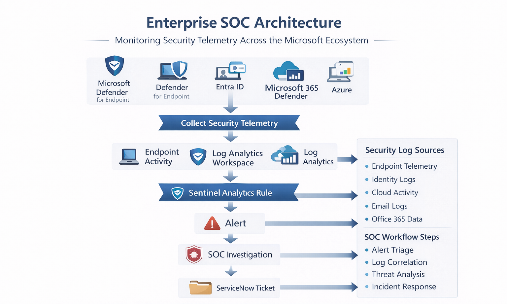

# Day 1 -- Enterprise SOC Architecture

## Objective

Understand how a Security Operations Center (SOC) is structured in a
modern enterprise using the Microsoft security ecosystem.

The SOC monitors security telemetry from endpoints, identity systems,
email platforms, and cloud infrastructure to detect attacks and respond
to incidents.

------------------------------------------------------------------------

# 1. Concept Overview

A Security Operations Center (SOC) is the operational team responsible
for:

-   Monitoring security telemetry
-   Detecting threats
-   Investigating suspicious activity
-   Responding to security incidents

SOC analysts work using a combination of:

-   SIEM platforms (central log monitoring)
-   EDR systems (endpoint activity monitoring)
-   XDR platforms (cross-domain detection)
-   SOAR tools (automation and response)

The SOC processes large volumes of security telemetry and converts it
into alerts and incidents that analysts investigate.

------------------------------------------------------------------------

# 2. Why SOC Exists in Enterprise Security

Large organizations operate thousands of systems:

-   Employee laptops
-   Servers
-   Cloud workloads
-   Identity systems
-   Email platforms

Attackers constantly attempt:

-   Credential theft
-   Malware execution
-   Privilege escalation
-   Data exfiltration

Without centralized monitoring, these attacks remain invisible.

SOC exists to:

-   Collect telemetry from all systems
-   Detect malicious behavior
-   Investigate suspicious activity
-   Coordinate incident response

------------------------------------------------------------------------

# 3. Enterprise SOC Architecture (Microsoft Security Stack)

Typical enterprise detection pipeline:

Endpoint Activity\
↓\
Microsoft Defender for Endpoint\
↓\
Log Analytics Workspace\
↓\
Microsoft Sentinel\
↓\
Alert\
↓\
Incident\
↓\
SOC Investigation\
↓\
ServiceNow Ticket\
↓\
Incident Response



------------------------------------------------------------------------

# 4. Core SOC Components

## Endpoint Security

Endpoints include:

-   Laptops
-   Desktops
-   Servers
-   Virtual machines

Telemetry collected:

-   Process creation
-   Command execution
-   File modifications
-   Network connections

Microsoft tool:

**Microsoft Defender for Endpoint**

Important telemetry tables:

-   DeviceProcessEvents
-   DeviceNetworkEvents
-   DeviceFileEvents

------------------------------------------------------------------------

## Identity Monitoring

Identity systems track authentication events.

Examples:

-   Login attempts
-   MFA verification
-   Role changes
-   Account creation

Microsoft tool:

**Microsoft Entra ID**

Important logs:

-   SigninLogs
-   AuditLogs

Used to detect:

-   Brute force attempts
-   Impossible travel
-   Credential theft

------------------------------------------------------------------------

## Email Security

Email is one of the most common attack entry points.

Attack examples:

-   Phishing
-   Malicious attachments
-   Credential harvesting links

Microsoft tool:

**Microsoft 365 Defender**

Telemetry includes:

-   Email delivery logs
-   Attachment scanning results
-   Phishing detections

------------------------------------------------------------------------

## Cloud Monitoring

Cloud platforms generate logs when administrators perform actions.

Examples:

-   VM creation
-   Role assignments
-   Resource deletion

Important log:

-   AzureActivity

Used to detect:

-   Privilege escalation
-   Suspicious resource changes
-   Unauthorized infrastructure deployment

------------------------------------------------------------------------

## SIEM (Security Information and Event Management)

A SIEM aggregates logs from all systems and applies detection rules.

Functions:

-   Log storage
-   Detection rules
-   Correlation across systems
-   Alert generation

Microsoft tool:

**Microsoft Sentinel**

Capabilities:

-   KQL-based detection rules
-   Alert correlation
-   Incident management
-   Threat hunting

------------------------------------------------------------------------

## SOAR (Security Orchestration Automation Response)

SOAR tools automate response actions.

Example automation:

Alert Trigger\
↓\
Enrich IP with threat intelligence\
↓\
Disable compromised account\
↓\
Notify SOC

Microsoft tool:

**Sentinel Playbooks** (Azure Logic Apps)

------------------------------------------------------------------------

## Ticketing System

SOC investigations require collaboration with other teams.

Example teams:

-   IT operations
-   Cloud teams
-   Identity administrators

Common platform:

**ServiceNow**

Used for:

-   Incident tracking
-   Response coordination
-   SLA enforcement

------------------------------------------------------------------------

# 5. Log Sources / Data Sources

Common Microsoft security telemetry tables:

  Log Source              Example Table
  ----------------------- ---------------------
  Identity logs           SigninLogs
  Windows security logs   SecurityEvent
  Endpoint telemetry      DeviceEvents
  Process activity        DeviceProcessEvents
  Azure infrastructure    AzureActivity
  Email activity          OfficeActivity

These logs are stored in **Log Analytics Workspace**, which acts as the
central telemetry repository.

------------------------------------------------------------------------

# 6. Detection Logic

Detections are implemented as analytics rules in Microsoft Sentinel.

Example detection pipeline:

User login failures\
↓\
Logs ingested into SigninLogs\
↓\
KQL query detects multiple failures\
↓\
Sentinel rule triggers alert

Example KQL detection:

``` kql
SigninLogs
| where ResultType != 0
| summarize FailedAttempts=count() by IPAddress, bin(TimeGenerated,5m)
| where FailedAttempts > 10
```

This identifies potential brute-force authentication attempts.

------------------------------------------------------------------------

# 7. Investigation Workflow

Typical SOC investigation flow:

Alert appears in Sentinel\
↓\
SOC L1 performs initial triage\
↓\
Check related logs\
↓\
Correlate activity across systems\
↓\
Determine False Positive or True Positive\
↓\
Escalate or close incident

Investigation questions:

-   Which user or device triggered the alert?
-   What activity occurred before and after?
-   Is the source IP suspicious?
-   Is the behavior normal for the user?

------------------------------------------------------------------------

# 8. Common Attack Scenarios

## Brute Force Attack

Attacker\
↓\
Multiple failed logins\
↓\
SigninLogs events\
↓\
Sentinel detection rule\
↓\
SOC alert

## Phishing Attack

Phishing email\
↓\
User clicks malicious link\
↓\
Credential theft\
↓\
Suspicious login\
↓\
SOC detection

## Malware Execution

Malicious attachment\
↓\
User opens file\
↓\
Word launches PowerShell\
↓\
EDR detects suspicious process

------------------------------------------------------------------------

# 9. SOC Analyst Responsibilities

## L1 SOC Analyst

Responsibilities:

-   Monitor alerts in Sentinel
-   Perform initial triage
-   Verify alert legitimacy
-   Escalate suspicious incidents

Typical tasks:

-   Check logs
-   Review user activity
-   Validate IP reputation

## L2 SOC Analyst

Responsibilities:

-   Deeper investigation
-   Cross-source correlation
-   Detection tuning
-   Incident response coordination

Tasks include:

-   Writing KQL queries
-   Adjusting analytics rules
-   Analyzing attacker behavior

------------------------------------------------------------------------

# 10. False Positive Considerations

Not all failed logins are attacks.

Possible benign causes:

-   User forgetting password
-   VPN reconnect attempts
-   Automated scripts
-   Password expiration

------------------------------------------------------------------------

# 11. Detection Tuning Strategy

SOC engineers tune rules by:

-   Excluding trusted IP ranges
-   Excluding service accounts
-   Adjusting thresholds

Example:

``` kql
| where IPAddress !in ("trusted corporate IP")
```

------------------------------------------------------------------------

# 12. Key Terminology

Important SOC terms:

-   Security Operations Center (SOC)
-   SIEM
-   EDR
-   XDR
-   Security telemetry
-   Alert correlation
-   Detection engineering
-   Incident investigation
-   Threat hunting

------------------------------------------------------------------------

# 13. SIEM vs EDR vs XDR

Understanding the difference between **SIEM, EDR, and XDR** is critical
for SOC analysts because these technologies work together in enterprise
security operations.

They serve different purposes in the detection and investigation
pipeline.

------------------------------------------------------------------------

## SIEM (Security Information and Event Management)

A **SIEM** platform collects and analyzes security logs from multiple
systems across the organization.

### Purpose

Centralized monitoring and correlation of security events.

### Key Capabilities

-   Log aggregation from multiple sources
-   Detection rules and alert generation
-   Event correlation across systems
-   Threat hunting using queries
-   Incident management

### Example Log Sources

-   Identity logs (SigninLogs)
-   Windows Security logs (SecurityEvent)
-   Azure activity logs (AzureActivity)
-   Email activity logs (OfficeActivity)
-   Endpoint telemetry

### Microsoft SIEM

**Microsoft Sentinel**

### Example Detection Workflow

    Log Source
    ↓
    Log Analytics Workspace
    ↓
    Sentinel Analytics Rule
    ↓
    Alert
    ↓
    Incident
    ↓
    SOC Investigation

### SOC Analyst Use

**L1 analysts** - Monitor alerts - Perform initial triage

**L2 analysts** - Write KQL detections - Correlate events across sources

------------------------------------------------------------------------

## EDR (Endpoint Detection and Response)

An **EDR** platform monitors activity on endpoints such as laptops,
servers, and virtual machines.

It focuses on detecting **malicious behavior occurring directly on
devices**.

### Purpose

Detect suspicious activity on endpoints.

### Endpoint Telemetry Examples

-   Process creation
-   File modifications
-   Registry changes
-   Network connections
-   Command-line execution

### Example Tables

    DeviceProcessEvents
    DeviceFileEvents
    DeviceNetworkEvents
    DeviceRegistryEvents

### Microsoft EDR

**Microsoft Defender for Endpoint**

### Example Detection Scenario

    Word.exe
    ↓
    powershell.exe
    ↓
    Encoded PowerShell command
    ↓
    EDR detection triggered

### SOC Investigation Example

Analyst checks:

-   Process tree
-   Command-line arguments
-   File hash reputation
-   Network connections

------------------------------------------------------------------------

## XDR (Extended Detection and Response)

**XDR** expands detection across multiple security domains.

Instead of analyzing only endpoint activity, it correlates data across:

-   Identity
-   Endpoint
-   Email
-   Cloud workloads

### Purpose

Cross-domain attack detection and correlation.

### Microsoft XDR Platform

**Microsoft 365 Defender**

It integrates telemetry from:

-   Microsoft Defender for Endpoint
-   Microsoft Defender for Identity
-   Microsoft Defender for Office365
-   Microsoft Defender for Cloud Apps

### Example Cross-Domain Attack Detection

    Phishing Email
    ↓
    User credential theft
    ↓
    Suspicious login detected
    ↓
    PowerShell execution on endpoint
    ↓
    XDR correlates events
    ↓
    Incident generated

This allows SOC teams to see the **full attack chain**.

------------------------------------------------------------------------

# Comparison Table

  -------------------------------------------------------------------------
  Feature           SIEM                EDR               XDR
  ----------------- ------------------- ----------------- -----------------
  Primary Focus     Log aggregation     Endpoint          Cross-domain
                                        monitoring        detection

  Data Sources      All systems         Endpoints         Multiple security
                                                          products

  Detection Method  Correlation rules   Behavioral        Cross-platform
                                        detection         correlation

  Investigation     Organization-wide   Device-level      Full attack chain
  Scope                                                   

  Microsoft Tool    Microsoft Sentinel  Defender for      Microsoft 365
                                        Endpoint          Defender
  -------------------------------------------------------------------------

------------------------------------------------------------------------

# How They Work Together in Enterprise SOC

In modern Microsoft security architecture these tools operate together.

    Endpoint Activity
    ↓
    Defender for Endpoint (EDR)
    ↓
    Microsoft 365 Defender (XDR correlation)
    ↓
    Log Analytics Workspace
    ↓
    Microsoft Sentinel (SIEM detection rules)
    ↓
    Alert
    ↓
    Incident
    ↓
    SOC Investigation

------------------------------------------------------------------------

# Key Takeaways

-   **SIEM** collects and analyzes logs across the entire organization.
-   **EDR** monitors detailed activity on endpoints.
-   **XDR** correlates security events across multiple domains.
-   Modern SOC environments combine all three to detect complex attacks.

# 14. Interview Talking Points

1.  SOC collects telemetry from endpoints, identity systems, email, and
    cloud infrastructure.
2.  Microsoft Defender generates endpoint telemetry analyzed by
    Microsoft Sentinel.
3.  Sentinel uses KQL-based analytics rules to convert events into
    alerts and incidents.
4.  SOC analysts investigate incidents by correlating identity,
    endpoint, and cloud logs.
5.  Enterprise SOC operations rely on log correlation, detection
    engineering, and incident response workflows.

------------------------------------------------------------------------

# 15. Key Takeaways

-   SOC centralizes security monitoring.
-   Microsoft Sentinel acts as the SIEM.
-   Defender provides endpoint telemetry.
-   Log Analytics stores security logs.
-   Analysts investigate alerts using correlated telemetry.
