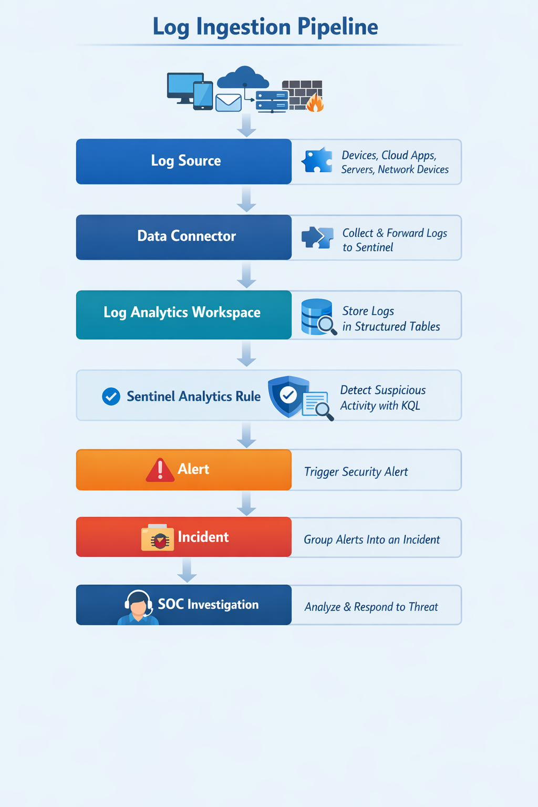
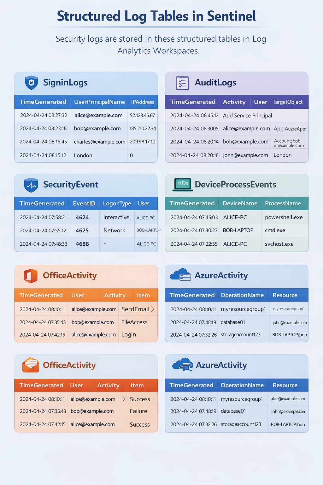

# Day 3 -- Data Connectors & Log Ingestion Pipeline

## Objective

Understand **how security telemetry flows from enterprise systems into
Microsoft Sentinel** and becomes usable for detection engineering,
alerting, and SOC investigations.

This topic is critical because **a SIEM is only as powerful as the
telemetry it ingests**. If logs are missing or incorrectly parsed,
detection rules will fail and attacks may go undetected.

------------------------------------------------------------------------

# Connecting From Day 2

On **Day 2**, we studied the Azure hierarchy and the **Log Analytics
Workspace**, which acts as the central storage location for security
telemetry in the Microsoft security ecosystem.

Azure hierarchy recap:

    Tenant
     └ Subscription
        └ Resource Group
           └ Log Analytics Workspace

The **Log Analytics Workspace** stores logs inside structured tables
such as:

-   SigninLogs
-   SecurityEvent
-   AzureActivity
-   DeviceEvents
-   DeviceProcessEvents
-   OfficeActivity

However, these tables **do not populate automatically**.

Security logs must first be **collected from enterprise systems** using
**Data Connectors**.

This leads to the next key concept in SOC architecture:

**Log Ingestion.**

------------------------------------------------------------------------

# Enterprise Log Ingestion Pipeline

In a Microsoft Sentinel environment, security telemetry flows through
the following pipeline:

    Log Source
    ↓
    Data Connector
    ↓
    Log Analytics Workspace
    ↓
    Sentinel Analytics Rule
    ↓
    Alert
    ↓
    Incident
    ↓
    SOC Investigation
    ↓
    Ticketing System (ServiceNow)

Understanding this pipeline helps analysts understand **where security
events originate, how they are processed, and how detections are
triggered**.

------------------------------------------------------------------------

# What Are Data Connectors?

Data Connectors are integrations that allow Microsoft Sentinel to
**collect security telemetry from external systems**.

These connectors are responsible for:

-   authenticating with the log source
-   collecting security events
-   transforming logs into structured schemas
-   sending logs to the Log Analytics Workspace

Without connectors, Sentinel would have **no visibility into enterprise
activity**.

------------------------------------------------------------------------

# Core Components of Log Ingestion

## 1. Log Source

A **log source** is any system that generates security events.

Common enterprise log sources include:

### Identity Systems

-   Microsoft Entra ID
-   Active Directory

### Endpoint Systems

-   Windows servers
-   Windows workstations
-   Linux servers

### Security Platforms

-   Microsoft Defender for Endpoint
-   Microsoft Defender for Identity

### Cloud Services

-   Azure resources
-   Office 365

### Network Devices

-   Firewalls
-   Routers
-   IDS/IPS systems

These systems generate events such as:

-   user login attempts
-   file access
-   process execution
-   network connections
-   privilege changes

------------------------------------------------------------------------

## 2. Data Connector

The **Data Connector** acts as the bridge between the log source and
Microsoft Sentinel.

Functions of a connector:

-   connect to the data source
-   pull or receive logs
-   map fields to Sentinel schema
-   forward logs to Log Analytics

Connectors can ingest logs using:

-   APIs
-   agents
-   syslog forwarding
-   event streaming

------------------------------------------------------------------------

## 3. Log Analytics Workspace

Once logs are ingested, they are stored inside **Log Analytics tables**.

Example tables:

| Table | Purpose |
|------|---------|
| SigninLogs | User authentication logs |
| SecurityEvent | Windows security logs |
| AzureActivity | Azure control plane activity |
| DeviceEvents | Endpoint security telemetry |
| DeviceProcessEvents | Process execution logs |
| OfficeActivity | Microsoft 365 user activity |

Each table contains **structured columns** such as:

-   TimeGenerated
-   UserPrincipalName
-   IPAddress
-   DeviceName
-   ProcessName
-   Activity

Structured tables allow analysts to **query logs using KQL**.

------------------------------------------------------------------------

# Important Microsoft Sentinel Connectors

## Entra ID (Azure AD)

The Entra ID connector collects **identity authentication and directory
activity logs**.

Key tables:

-   SigninLogs
-   AuditLogs

Security detections include:

-   brute force attacks
-   password spray attacks
-   impossible travel
-   suspicious application consent

Example log fields:

-   UserPrincipalName
-   IPAddress
-   Location
-   DeviceDetail
-   ResultType

------------------------------------------------------------------------

## Microsoft Defender Connector

This connector integrates telemetry from **Microsoft Defender security
products**.

Key tables:

-   DeviceEvents
-   DeviceProcessEvents
-   DeviceNetworkEvents
-   DeviceFileEvents

These logs help detect:

-   malware execution
-   suspicious command line usage
-   lateral movement
-   file modification activity

------------------------------------------------------------------------

## Office 365 Connector

This connector collects **activity logs from Microsoft 365 services**.

Key table:

OfficeActivity

Activities include:

-   email sending
-   mailbox access
-   SharePoint file activity
-   Teams activity

SOC analysts use these logs to detect:

-   phishing activity
-   suspicious mailbox access
-   data exfiltration

------------------------------------------------------------------------

## Windows Security Logs

Windows servers generate **Security Event Logs**.

These are ingested into the **SecurityEvent** table.

Important Event IDs:

| Event ID | Meaning |
|---------|---------|
| 4624 | Successful login |
| 4625 | Failed login |
| 4688 | Process creation |
| 4720 | User account created |
| 4728 | User added to group |

These logs are essential for detecting:

-   brute force attempts
-   privilege escalation
-   suspicious processes

------------------------------------------------------------------------

## Syslog Connector

The Syslog connector is used to collect logs from:

-   Linux servers
-   network devices
-   firewalls
-   intrusion detection systems

Common log events:

-   SSH login attempts
-   firewall deny actions
-   authentication failures
-   system service logs

------------------------------------------------------------------------

# Parsing

Parsing converts **raw logs into structured fields**.

Example raw log:

    User login from IP 192.168.1.20 using Chrome

| Field | Value |
|------|------|
| UserPrincipalName | alice@company.com |
| IPAddress | 192.168.1.20 |
| Application | Chrome |
| ResultType | Success |

Structured fields allow analysts to run detection queries.

------------------------------------------------------------------------

# Normalization

Different systems may represent the same data differently.

Example:

| System | Field Name |
|-------|------------|
| Firewall | src_ip |
| Linux | client_ip |
| Azure | IPAddress |

Normalization converts these to a **standard schema**.

Example normalized field:

IPAddress

Benefits:

-   easier cross-source correlation
-   consistent detection queries
-   simplified investigations

Microsoft Sentinel uses **ASIM (Advanced Security Information Model)**
to standardize schemas.

------------------------------------------------------------------------

# Detection Logic Using Ingested Logs

Example detection: **Brute force login attempts**

    SigninLogs
    | where ResultType != 0
    | summarize FailedAttempts = count() by IPAddress, bin(TimeGenerated,5m)
    | where FailedAttempts > 10

Detection logic:

-   multiple failed login attempts
-   from same IP
-   within short time window

This indicates possible **password guessing activity**.

------------------------------------------------------------------------

# SOC Investigation Workflow

When Sentinel triggers an alert, SOC analysts investigate using the
ingested telemetry.

Typical investigation flow:

    Alert Triggered
    ↓
    Identify the data source
    ↓
    Review raw log events
    ↓
    Analyze user account involved
    ↓
    Check device activity
    ↓
    Review IP reputation
    ↓
    Determine true positive or false positive

Key investigation questions:

-   Which user initiated the activity?
-   Which device was involved?
-   What IP address initiated the action?
-   Is the activity malicious or legitimate?

------------------------------------------------------------------------

# Real Attack Scenario

Example: **Password Spray Attack**

An attacker attempts logins across multiple accounts using the same
password.

Example attempt list:

    User1
    User2
    User3
    User4
    User5

All attempts originate from:

    185.210.x.x

Pipeline:

    Login attempts
    ↓
    Azure AD logs generated
    ↓
    Data connector collects logs
    ↓
    SigninLogs table populated
    ↓
    Sentinel detection rule evaluates logs
    ↓
    Alert generated
    ↓
    SOC analyst investigates

------------------------------------------------------------------------

# SOC Analyst Responsibilities

## L1 SOC Analyst

Responsibilities include:

-   monitoring alerts
-   validating alert context
-   reviewing login patterns
-   checking suspicious IPs
-   escalating incidents to L2

------------------------------------------------------------------------

## L2 SOC Analyst

Responsibilities include:

-   deeper log correlation
-   analyzing multiple data sources
-   detection rule tuning
-   threat hunting
-   confirming security incidents

------------------------------------------------------------------------

# False Positive Examples

Some legitimate activity may trigger detections.

Examples:

-   vulnerability scanners
-   penetration testing exercises
-   automated scripts
-   misconfigured applications
-   repeated VPN authentication failures

SOC teams must identify and tune these cases.

------------------------------------------------------------------------

# Detection Tuning Strategy

Common tuning methods include:

-   excluding trusted IP ranges
-   excluding service accounts
-   adjusting alert thresholds
-   increasing time windows
-   correlating multiple log sources

Example tuning:

Exclude corporate VPN gateway IP from brute force detection.

------------------------------------------------------------------------

# Key Terminology

Important SOC terms related to log ingestion:

-   Data Connector
-   Log Ingestion
-   Security Telemetry
-   Parsing
-   Normalization
-   Log Analytics Workspace
-   Detection Rule
-   Alert
-   Incident
-   KQL Query

------------------------------------------------------------------------

# Key Takeaways

-   Data connectors ingest security telemetry into Microsoft Sentinel.
-   Logs are stored in structured tables inside the Log Analytics
    Workspace.
-   Parsing converts raw logs into structured fields.
-   Normalization standardizes log schemas across different sources.
-   Sentinel analytics rules analyze logs to detect suspicious activity.
-   SOC analysts investigate alerts using telemetry from multiple log
    sources.
