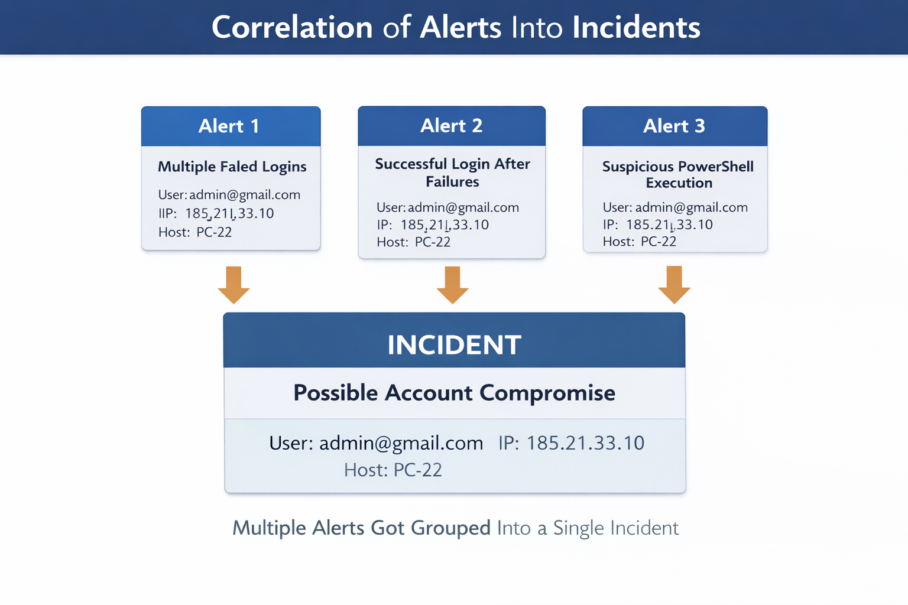
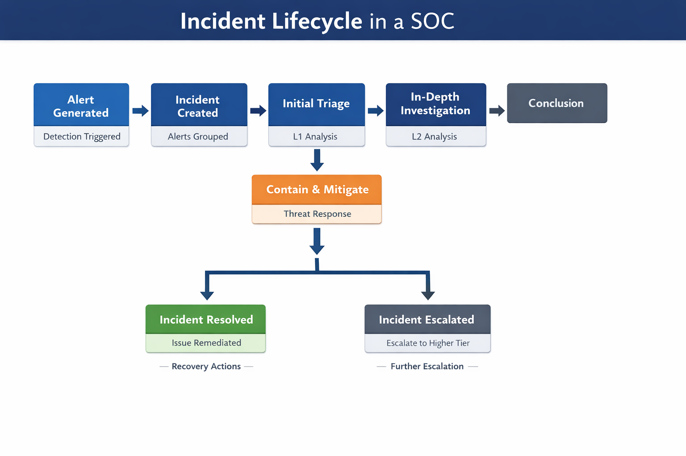

# Day 4 -- Alerts vs Incidents (Deep SOC Study)

## Objective

This document explains in depth how **security telemetry becomes alerts
and how alerts become incidents in an enterprise SOC environment**.

The goal is to understand:

• how detection rules generate alerts\
• how SIEM systems correlate alerts\
• how incidents represent investigation cases\
• how SOC analysts investigate alerts\
• how alerts are tuned to reduce noise

Understanding alerts and incidents is fundamental for **Microsoft
Sentinel SIEM operations and SOC investigations**.

------------------------------------------------------------------------

# Recap From Day 3 -- Log Ingestion Pipeline

Before alerts exist, telemetry must first be collected.

Typical enterprise pipeline:

    Security Event Source
    ↓
    Connector
    ↓
    Log Analytics Workspace
    ↓
    Structured Tables
    ↓
    Analytics Rules
    ↓
    Alert
    ↓
    Incident

Security telemetry sources include:

| Source | Example Table |
|------|---------------|
| Entra ID | SigninLogs |
| Windows Servers | SecurityEvent |
| Defender for Endpoint | DeviceProcessEvents |
| Azure Control Plane | AzureActivity |
| Microsoft 365 | OfficeActivity |

Large organizations generate **millions of log events per day**.

Because of this scale, SOC teams rely on **automated detection rules**.

------------------------------------------------------------------------

# Enterprise SOC Detection Pipeline

Security monitoring architecture:

    Endpoint Activity
    ↓
    Defender Telemetry
    ↓
    Log Analytics Workspace
    ↓
    Sentinel Analytics Rule
    ↓
    Alert Generated
    ↓
    Alert Correlation
    ↓
    Incident Created
    ↓
    SOC Investigation
    ↓
    Containment

Each stage transforms raw telemetry into **actionable security
intelligence**.

------------------------------------------------------------------------

# What Is an Alert

An alert is generated when a **detection rule identifies suspicious
behavior**.

Alerts indicate:

    Potential threat detected
    Investigation required

Example alert:

    Alert Name: Multiple Failed Login Attempts
    Severity: Medium
    User: admin@company.com
    IP: 185.21.33.10

Alerts include:

| Field | Description |
|------|-------------|
| Alert Name | detection rule |
| Severity | risk level |
| Entities | user, IP, host |
| Evidence | logs triggering detection |
| Timestamp | event time |

------------------------------------------------------------------------

# What Is an Incident

An incident is a **collection of correlated alerts representing a
security case**.

Example:

    Alert 1 – Failed login attempts
    Alert 2 – Successful login
    Alert 3 – Suspicious PowerShell execution

These alerts share common entities.

Result:

    Incident: Possible Account Compromise

Instead of analyzing each alert individually, SOC analysts investigate
**the full attack chain**.

------------------------------------------------------------------------

# Why Alerts Exist

Enterprise environments produce massive volumes of telemetry.

Example environment:

    10,000 endpoints
    100 servers
    multiple cloud services

This can generate:

    Millions of log events per hour

Detection rules automatically identify suspicious patterns.

Examples:

• brute force authentication attempts\
• unusual login locations\
• suspicious PowerShell commands\
• privilege escalation activity

When rules trigger:

    Alert Generated

Alerts act as **automated threat sensors**.

------------------------------------------------------------------------

# Why Incidents Exist

Attacks often trigger multiple alerts.

Example attack chain:

    Credential phishing
    ↓
    Suspicious login
    ↓
    PowerShell execution
    ↓
    Privilege escalation
    ↓
    Lateral movement

Without correlation:

    5 alerts
    5 investigations

With correlation:

    1 incident
    Full attack chain visible

This significantly improves SOC efficiency.

------------------------------------------------------------------------

# Alert Correlation

SIEM systems group alerts based on shared entities.

Common correlation attributes:

| Attribute | Description |
|----------|-------------|
| User | same account |
| IP | same source address |
| Host | same device |
| Process | same executable |
| File | same artifact |

Example:

    Alert 1 – Failed login attempts
    User: admin
    IP: 185.21.33.10

    Alert 2 – Successful login
    User: admin
    IP: 185.21.33.10

    Alert 3 – PowerShell execution
    User: admin
    Host: PC‑22

These alerts become:

    Incident: Possible Account Compromise

------------------------------------------------------------------------

# Alert Severity

Alerts are prioritized using severity levels.

| Severity | Meaning |
|---------|---------|
| Low | suspicious but low risk |
| Medium | potential threat |
| High | likely malicious |
| Critical | confirmed attack |

Severity determines investigation priority.

Example SLA:

| Severity | Response Time |
|---------|---------------|
| Critical | 15 minutes |
| High | 30 minutes |
| Medium | 2 hours |
| Low | 24 hours |

------------------------------------------------------------------------

# Detection Logic

Detection rules typically use the following techniques.

### Threshold Detection

Example:

    More than 10 failed logins within 5 minutes

### Time Correlation

Example:

    Failed login attempts followed by successful login

### Behavioral Detection

Example:

    User logs in from two countries within one hour

### Rare Activity Detection

Example:

    Process executed on fewer than 5 devices

These techniques form the foundation of **detection engineering**.

------------------------------------------------------------------------

# Example Detection Query

Example brute force detection query:

    SigninLogs
    | where ResultType != 0
    | summarize FailedAttempts=count() by IPAddress, bin(TimeGenerated,5m)
    | where FailedAttempts > 10

If condition is met:

    Alert Generated

------------------------------------------------------------------------

# Entity Mapping

Entity mapping links alerts to real-world objects.

Common entities:

| Entity | Description |
|------|-------------|
| User | account performing activity |
| IP Address | network origin |
| Host | device |
| Process | running program |
| File | suspicious artifact |

Example entity mapping:

    User: admin@company.com
    IP: 185.21.33.10
    Host: PC‑22
    Process: powershell.exe

Entity mapping enables **alert correlation and investigation graphs**.

------------------------------------------------------------------------

# SOC Investigation Workflow

When an incident appears in the queue, analysts follow structured
investigation steps.

### Step 1 -- Review Incident

Check:

• severity\
• alerts inside incident\
• affected entities

### Step 2 -- Identify Entities

Questions:

    Which user?
    Which IP address?
    Which device?

### Step 3 -- Analyze Evidence

Logs analyzed:

    SigninLogs
    SecurityEvent
    DeviceProcessEvents
    AzureActivity

### Step 4 -- Build Timeline

Example timeline:

    09:12 – Failed login attempts
    09:15 – Successful login
    09:18 – PowerShell execution
    09:21 – Privilege escalation

### Step 5 -- Determine Outcome

Possible outcomes:

    True Positive
    False Positive
    Benign Activity

If malicious:

    Escalate to L2
    Initiate containment

------------------------------------------------------------------------

# Real Attack Scenario

Example attack investigation:

    Phishing email sent
    ↓
    User enters credentials
    ↓
    Attacker logs in
    ↓
    PowerShell payload executed
    ↓
    Privilege escalation

Alerts triggered:

    Suspicious Login Alert
    PowerShell Execution Alert
    Privilege Escalation Alert

Grouped incident:

    Possible Account Compromise

------------------------------------------------------------------------

# SOC Analyst Responsibilities

## L1 SOC Analyst

Responsibilities:

• monitor incident queue\
• perform alert triage\
• validate suspicious activity\
• escalate incidents

## L2 SOC Analyst

Responsibilities:

• deep investigation\
• threat hunting\
• cross‑source correlation\
• detection tuning

------------------------------------------------------------------------

# False Positives

Not every alert represents an attack.

Examples:

### Login Failures

Possible benign reasons:

• forgotten passwords\
• VPN reconnect attempts\
• mobile device retries

### PowerShell Execution

Possible benign reasons:

• automation scripts\
• system administrator actions

SOC analysts must validate context before escalation.

------------------------------------------------------------------------

# Detection Tuning

Detection rules are tuned to reduce alert noise.

Example tuning methods:

Exclude service accounts:

    | where UserPrincipalName !contains "svc"

Exclude trusted IP ranges:

    | where IPAddress !startswith "10."

Increase thresholds:

    FailedAttempts > 20

Goal:

    High signal
    Low noise

------------------------------------------------------------------------

# Key Terminology

Important SOC terms:

    Alert
    Incident
    Detection Rule
    Alert Correlation
    Entity Mapping
    Security Telemetry
    Alert Fatigue
    SOC Investigation
    Threat Hunting
    Detection Engineering

------------------------------------------------------------------------

# Key Takeaways

• Alerts are generated by detection rules\
• Incidents group related alerts\
• Entity mapping enables correlation\
• Incidents represent investigation cases\
• Understanding alerts vs incidents is fundamental for SOC operations
