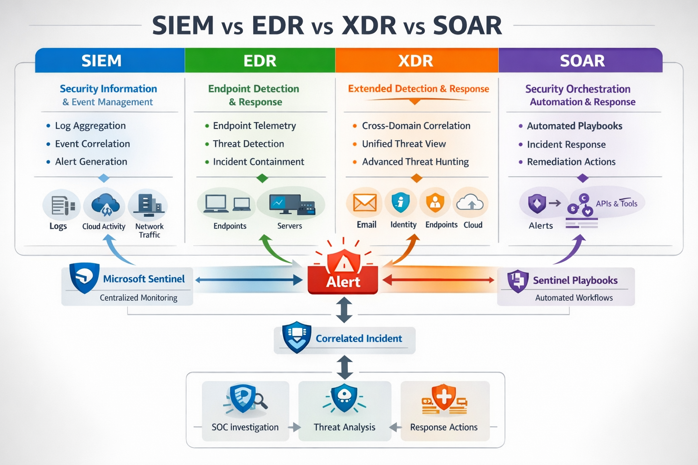

# Day 5 -- SIEM vs EDR vs XDR vs SOAR

## Enterprise SOC Deep Dive

------------------------------------------------------------------------

# Continuity from Day 4 -- Alerts vs Incidents

In **Day 4**, we studied how detections create **alerts**, and how
alerts are grouped into **incidents** to reduce alert fatigue and help
SOC analysts investigate threats efficiently.

Basic detection pipeline:

Endpoint / Identity / Cloud Activity\
↓\
Security Telemetry Generated\
↓\
Detection Rule\
↓\
Alert\
↓\
Incident\
↓\
SOC Investigation

But an important question arises:

**Where do these alerts come from?**

They come from different security platforms deployed across the
enterprise environment.

Examples:

-   Endpoint security systems
-   Identity monitoring platforms
-   Email protection systems
-   Cloud security monitoring
-   Centralized log analysis systems

These technologies form the core of the **modern SOC detection
architecture**.

The four most important platforms are:

-   **SIEM -- Security Information and Event Management**
-   **EDR -- Endpoint Detection and Response**
-   **XDR -- Extended Detection and Response**
-   **SOAR -- Security Orchestration Automation and Response**

Understanding how these technologies differ --- and how they work
together --- is fundamental for any SOC analyst.

------------------------------------------------------------------------

# Enterprise Security Visibility Problem

Modern enterprise environments are extremely complex.

Organizations typically operate across:

-   thousands of endpoints
-   multiple cloud platforms
-   hybrid identity systems
-   corporate email systems
-   internal applications
-   external SaaS services

Each system generates **massive volumes of security telemetry**.

Examples of telemetry:

-   authentication events
-   process execution logs
-   network connections
-   file access activity
-   administrative actions
-   email interactions

Without centralized security monitoring, it becomes impossible to detect
attacks that span multiple systems.

Example attack path:

Phishing Email\
↓\
User Credential Theft\
↓\
Suspicious Login\
↓\
PowerShell Execution\
↓\
Privilege Escalation\
↓\
Data Exfiltration

Each stage occurs in **different parts of the infrastructure**.

Different security technologies detect different parts of the attack.

------------------------------------------------------------------------

# Overview of SOC Security Technologies

| Technology | Primary Focus |
|-----------|---------------|
| SIEM | Centralized log analysis |
| EDR | Endpoint behavior monitoring |
| XDR | Cross-domain correlation |
| SOAR | Automated incident response |

These tools do not replace each other.

They **complement each other** inside the SOC detection architecture.

------------------------------------------------------------------------

# 1 -- SIEM (Security Information and Event Management)

## Concept Overview

A **SIEM** platform collects, stores, and analyzes security logs from
across the organization.

Its purpose is to:

-   aggregate logs
-   normalize data
-   detect suspicious patterns
-   generate alerts
-   manage incidents

In Microsoft environments:

**Microsoft Sentinel is the SIEM platform.**

------------------------------------------------------------------------

## Core SIEM Capabilities

### Log Aggregation

SIEM platforms collect logs from multiple sources.

Examples:

  Source         Example Logs
  -------------- ------------------------
  Identity       Sign-in logs
  Endpoints      Windows security logs
  Cloud          Azure Activity logs
  Applications   Application logs
  Email          Exchange activity logs

All logs are centralized into:

**Log Analytics Workspace**

------------------------------------------------------------------------

### Log Normalization

Different systems generate logs in different formats.

SIEM normalizes logs into structured tables.

Examples in Microsoft Sentinel:

-   SigninLogs
-   SecurityEvent
-   AzureActivity
-   DeviceEvents
-   OfficeActivity

This enables **efficient querying and correlation**.

------------------------------------------------------------------------

### Event Correlation

SIEM platforms correlate events across multiple systems.

Example correlation:

User login from suspicious IP\
+\
Endpoint running encoded PowerShell\
+\
Large SharePoint download

These events individually may appear normal.

But together they indicate **possible account compromise**.

------------------------------------------------------------------------

### Detection Rules

SIEM platforms allow security teams to create detection logic.

Example detection idea:

Detect multiple failed login attempts from a single IP.

Example query:

SigninLogs \| where ResultType != 0 \| summarize FailedAttempts=count()
by IPAddress, bin(TimeGenerated,5m) \| where FailedAttempts \> 10

This generates an **alert for potential brute-force attacks**.

------------------------------------------------------------------------

# 2 -- EDR (Endpoint Detection and Response)

## Concept Overview

EDR platforms monitor **endpoint activity in real time**.

Endpoints include:

-   laptops
-   desktops
-   servers
-   cloud virtual machines

EDR platforms provide **deep visibility into operating system
behavior**.

Microsoft solution:

**Microsoft Defender for Endpoint**

------------------------------------------------------------------------

## Why Endpoint Monitoring Is Critical

Most cyber attacks ultimately execute code on endpoints.

Examples:

-   malware execution
-   PowerShell attacks
-   ransomware deployment
-   credential dumping
-   lateral movement tools

Without endpoint telemetry, these attacks remain invisible.

------------------------------------------------------------------------

## Endpoint Telemetry Collected by EDR

Examples of telemetry:

  Activity                 Description
  ------------------------ ------------------------
  Process execution        Programs launched
  Command-line arguments   PowerShell commands
  File creation            Malware dropped
  Network connections      C2 traffic
  Registry changes         Persistence mechanisms

------------------------------------------------------------------------

## Process Tree Analysis

EDR platforms track parent-child process relationships.

Example attack chain:

winword.exe\
↓\
powershell.exe\
↓\
malicious_script.ps1\
↓\
payload.exe

SOC analysts can visually analyze this process chain to detect malicious
behavior.

------------------------------------------------------------------------

## Important Defender Telemetry Tables

Common tables used for detection:

DeviceProcessEvents\
DeviceNetworkEvents\
DeviceFileEvents\
DeviceRegistryEvents\
DeviceLogonEvents

These tables allow analysts to perform **behavioral detection using KQL
queries**.

------------------------------------------------------------------------

# 3 -- XDR (Extended Detection and Response)

## Concept Overview

XDR platforms correlate signals from **multiple security domains**.

Instead of focusing on only endpoints, XDR integrates:

-   endpoint telemetry
-   identity events
-   email activity
-   cloud application logs

Microsoft XDR platform:

**Microsoft 365 Defender**

------------------------------------------------------------------------

## Why XDR Exists

Security tools historically operated in silos.

Example:

EDR monitors endpoints\
Email security monitors email\
Identity systems monitor logins

Attackers exploit this fragmentation.

XDR breaks these silos by correlating signals across systems.

------------------------------------------------------------------------

## Example XDR Detection

Example attack chain detected by XDR:

Phishing Email\
↓\
User clicks malicious link\
↓\
User logs in from unusual location\
↓\
PowerShell script executed\
↓\
Suspicious network connection

XDR correlates these signals and generates **a single incident**.

------------------------------------------------------------------------

# 4 -- SOAR (Security Orchestration Automation and Response)

## Concept Overview

SOAR platforms automate security response workflows.

Instead of analysts manually performing repetitive tasks, SOAR automates
them using playbooks.

Microsoft solution:

**Microsoft Sentinel Playbooks**

------------------------------------------------------------------------

## Why Automation Is Necessary

SOC teams often deal with thousands of alerts per day.

Common repetitive tasks include:

-   checking IP reputation
-   checking file hash reputation
-   disabling compromised accounts
-   blocking malicious domains

Automation reduces analyst workload and speeds response time.

------------------------------------------------------------------------

## Example SOAR Playbook

Alert triggered\
↓\
Extract IP address\
↓\
Check threat intelligence database\
↓\
If malicious → block IP\
↓\
Disable affected account\
↓\
Create ServiceNow ticket\
↓\
Notify SOC team

This reduces **Mean Time To Respond (MTTR)**.

------------------------------------------------------------------------

# Enterprise Detection Pipeline

Complete enterprise detection pipeline:

Endpoint Activity\
↓\
Defender Endpoint Detection (EDR)\
↓\
Telemetry stored in Log Analytics Workspace\
↓\
Microsoft Sentinel Analytics Rule (SIEM)\
↓\
Alert Generated\
↓\
Incident Created\
↓\
Microsoft Sentinel Playbook (SOAR) executes response\
↓\
SOC Analyst Investigation

------------------------------------------------------------------------

# SOC Analyst Responsibilities

## L1 SOC Analyst

Responsibilities include:

-   monitoring SIEM alerts
-   performing alert triage
-   validating suspicious activity
-   gathering context from logs
-   escalating complex incidents

------------------------------------------------------------------------

## L2 SOC Analyst

Responsibilities include:

-   deep investigation
-   cross-log correlation
-   detection tuning
-   threat hunting
-   incident containment support

------------------------------------------------------------------------

# False Positive Considerations

Not every alert indicates an attack.

Examples of benign triggers:

-   vulnerability scanners generating login attempts
-   administrators running PowerShell scripts
-   automated system processes

SOC teams must validate alerts carefully before escalation.

------------------------------------------------------------------------

# Detection Tuning Strategy

To reduce false positives, analysts apply tuning strategies:

-   excluding service accounts
-   excluding internal scanning IPs
-   adjusting detection thresholds
-   filtering known benign activity

Detection tuning improves SOC efficiency.

------------------------------------------------------------------------

# Key Terminology

Important SOC terms:

SIEM\
EDR\
XDR\
SOAR\
Security Telemetry\
Detection Engineering\
Threat Hunting\
Incident Response\
Alert Correlation

------------------------------------------------------------------------

# Key Takeaways

Modern enterprise SOC environments rely on multiple security
technologies working together.

SIEM centralizes security logs and performs correlation.

EDR monitors endpoint activity and detects malicious behavior.

XDR correlates signals across identity, endpoint, email, and cloud
systems.

SOAR automates security response workflows.

Together these systems create a **comprehensive detection and response
ecosystem** used by modern SOC teams.
