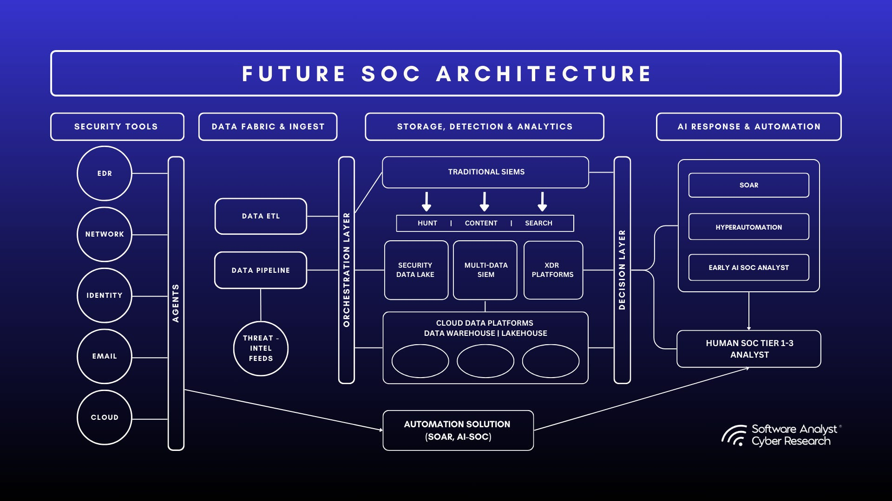
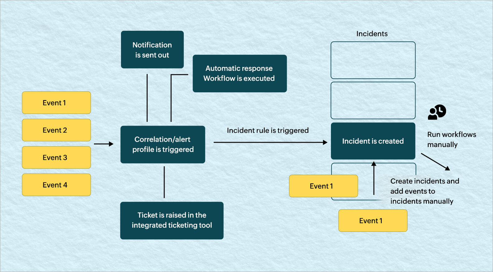
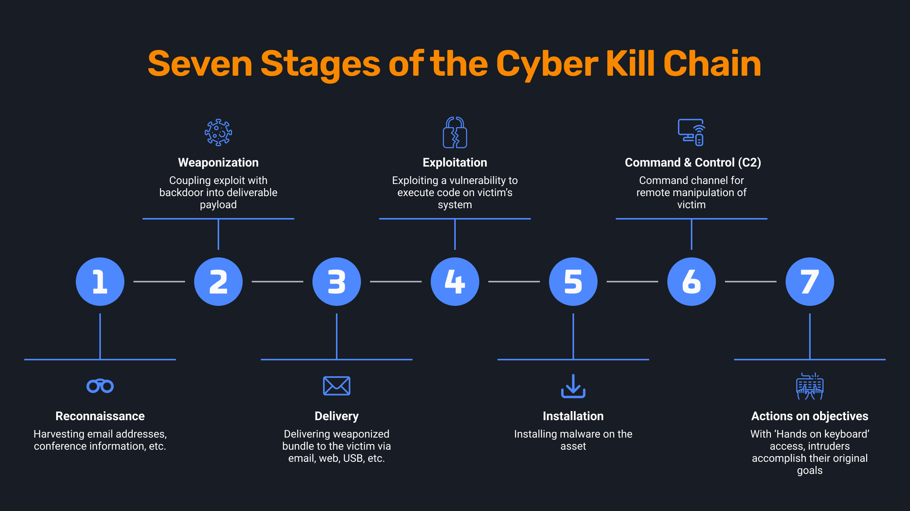

# Day 6 – Full Enterprise Detection Pipeline

## Objective

By Day 6 we connect **everything learned in Week 1** into a complete enterprise SOC workflow.

Previous topics:

Day 1 – SOC Architecture
Day 2 – Log Analytics Workspace
Day 3 – Log Ingestion Pipeline
Day 4 – Alerts vs Incidents
Day 5 – SIEM vs EDR vs XDR vs SOAR

Day 6 connects these components into the **complete enterprise detection pipeline used in real Security Operations Centers (SOC)**.

The pipeline we study today:

```
Endpoint Activity
↓
Microsoft Defender Telemetry
↓
Log Analytics Workspace
↓
Microsoft Sentinel Analytics Rule
↓
Alert
↓
Incident
↓
SOC Investigation
↓
ServiceNow Ticket
↓
Incident Resolution
```

This is the **core operational workflow of enterprise SOC environments**.

Understanding this pipeline is critical for:

* SOC analysts
* detection engineers
* threat hunters
* security engineers

---

# 1. Concept Overview – What is a Detection Pipeline?

A **detection pipeline** is the complete process that transforms:

```
Raw Activity
↓
Security Telemetry
↓
Detection Logic
↓
Alerts
↓
Correlated Incidents
↓
SOC Investigation
↓
Incident Response
```

In enterprise environments:

* Millions of events occur every minute
* Most events are benign
* A small percentage indicate malicious activity

The detection pipeline filters and analyzes telemetry so SOC teams only investigate **meaningful security incidents**.

Without this pipeline:

* Logs remain unused
* Attacks remain hidden
* SOC teams cannot operate effectively

---

# 2. Why Detection Pipelines Exist

Modern enterprise environments generate enormous telemetry volumes.

Examples:

Endpoint telemetry
Authentication events
Network activity
Email activity
Cloud infrastructure logs
Application logs

Large enterprises can generate:

```
100 million – 1 billion events per day
```

Manual log review is impossible.

Detection pipelines solve this by:

1. Collecting telemetry automatically
2. Normalizing logs
3. Applying detection logic
4. Generating alerts
5. Correlating attack activity
6. Assigning incidents to analysts

---

# 3. Enterprise SOC Detection Architecture

Typical Microsoft enterprise security architecture:

```
Endpoint Devices
↓
Microsoft Defender for Endpoint
↓
Microsoft 365 Defender
↓
Log Analytics Workspace
↓
Microsoft Sentinel (SIEM)
↓
Analytics Detection Rules
↓
Security Alerts
↓
Incident Creation
↓
SOC Investigation
↓
ServiceNow Incident Ticket
↓
Response & Remediation
```


Each stage performs a **specific function in the detection pipeline**.

---

# 4. Stage 1 – Endpoint Activity

Everything begins with **activity on endpoints**.

Endpoints include:

* laptops
* servers
* virtual machines
* cloud workloads

Common endpoint activity:

* user logins
* file downloads
* application execution
* PowerShell scripts
* network connections
* registry modifications

Example malicious activity chain:

```
Word.exe
↓
powershell.exe
↓
download malware
↓
execute payload
```

Without endpoint telemetry, the SOC would never detect this.

---

# 5. Stage 2 – Microsoft Defender for Endpoint (EDR)

Microsoft Defender for Endpoint acts as the **Endpoint Detection and Response (EDR)** system.

EDR continuously monitors endpoint behavior.

Telemetry collected includes:

Process execution
Command-line arguments
File creation and modification
Network connections
Registry changes
Credential access behavior

Example telemetry tables:

```
DeviceProcessEvents
DeviceNetworkEvents
DeviceFileEvents
DeviceRegistryEvents
DeviceLogonEvents
DeviceImageLoadEvents
```

Example suspicious activity detected by Defender:

```
powershell.exe -EncodedCommand
```

Defender may generate an **EDR alert** immediately.

However, the telemetry also flows into the **SIEM for correlation**.

---

# 6. Stage 3 – Telemetry Storage (Log Analytics Workspace)

The **Log Analytics Workspace** is the central log storage platform.

It collects logs from multiple sources:

Microsoft Defender
Microsoft Entra ID
Azure Activity Logs
Office 365
Windows Security Logs
Syslog devices
Network firewalls

Example tables stored in Log Analytics:

```
SigninLogs
SecurityEvent
AzureActivity
DeviceProcessEvents
OfficeActivity
AuditLogs
DeviceNetworkEvents
```

Log Analytics provides:

* scalable storage
* centralized telemetry
* KQL querying capability

This is where cross-source correlation becomes possible.

---

# 7. Stage 4 – Microsoft Sentinel (SIEM Layer)

Microsoft Sentinel is the **Security Information and Event Management (SIEM)** platform.

Sentinel performs several key functions:

Detection rule execution
Alert correlation
Incident management
Threat hunting
Automation via playbooks

Sentinel continuously scans incoming telemetry.

The detection logic is implemented through **Analytics Rules**.

---

# 8. Stage 5 – Detection Engineering (Analytics Rules)

Analytics rules define **how attacks are detected**.

Each rule contains:

* KQL query
* time window
* detection threshold
* entity mapping
* severity level

Example brute-force detection rule:

```kql
SigninLogs
| where ResultType != 0
| summarize FailedAttempts = count() by IPAddress, bin(TimeGenerated,5m)
| where FailedAttempts > 10
```

Detection strategies used in enterprise SOC:

Threshold detection
Rare behavior detection
Behavioral anomalies
Cross-log correlation
Threat intelligence matching

Example correlation detection:

```
Failed logins
+
Successful login
+
New device access
```

---

# 9. Stage 6 – Alert Generation

When detection rules trigger, Sentinel generates **alerts**.

Alert properties:

* rule name
* timestamp
* affected entities
* severity
* evidence logs
* MITRE ATT&CK mapping

Example alert:

```
Multiple Failed Login Attempts Detected
```

However, a single attack often generates **multiple alerts**.

---

# 10. Stage 7 – Incident Creation

To reduce alert fatigue, Sentinel groups related alerts into **incidents**.

Example attack sequence:

```
Multiple failed logins
↓
Successful login
↓
PowerShell execution
↓
Suspicious outbound connection
```

Instead of four alerts, Sentinel creates:

```
1 correlated incident
```

The incident contains:

* multiple alerts
* related entities
* attack timeline
* investigation graph



---

# 11. Stage 8 – SOC Investigation

The incident enters the **SOC investigation queue**.

Analysts perform:

*Initial triage
*Log correlation
*Impact analysis
*Threat validation



Typical investigation questions:

*What triggered this alert?
*Which user performed the activity?
*Which device was involved?
*What commands were executed?
*Is the behavior malicious?

Investigation tools include:

*KQL queries
*Device timeline
*Threat intelligence lookups
*Process tree analysis

---

# 12. Stage 9 – ServiceNow Ticket Creation

Most enterprises integrate Sentinel with **ServiceNow** for incident tracking.

Workflow:

```
Sentinel Incident
↓
ServiceNow Ticket
```

Ticket fields include:

*Incident severity
*Affected systems
*Investigation notes
*Remediation steps

ServiceNow allows collaboration between:

*SOC team
*IT operations
*Security engineering

---

# 13. End-to-End Attack Scenario

Example attack pipeline:

```
Phishing Email
↓
User enters credentials
↓
Attacker logs into Azure account
↓
PowerShell execution on endpoint
↓
Malware download
↓
Command-and-control communication
```

Detection pipeline:

```
Endpoint Activity
↓
Defender Telemetry
↓
Log Analytics Workspace
↓
Sentinel Detection Rule
↓
Alert
↓
Incident
↓
SOC Investigation
↓
ServiceNow Ticket
```

---

# 14. SOC Analyst Responsibilities

### L1 SOC Analyst

Responsibilities:

*Monitor alert queue
*Perform initial triage
*Validate suspicious activity
*Escalate incidents

Typical workflow:

```
Alert
↓
Quick log review
↓
False positive OR escalate
```

---

### L2 SOC Analyst

Responsibilities:

*Deep investigation
*Root cause analysis
*Attack timeline reconstruction
*Detection rule tuning

L2 analysts often write advanced **KQL detection queries**.

---

# 15. False Positive Considerations

Not every detection indicates an attack.

Common false positives include:

*Users mistyping passwords
*Automated scripts
*Security scanners
*Administrative PowerShell usage

SOC analysts must analyze **business context**.

---

# 16. Detection Tuning Strategies

Detection tuning reduces noise.

Common tuning methods:

*Exclude trusted IP ranges
*Exclude service accounts
*Adjust detection thresholds
*Correlate multiple signals

Example improvement:

Instead of:

```
5 failed logins
```

Use:

```
15 failed logins within 5 minutes
+
new device login
```

---

# 17. Key Enterprise SOC Terminology

Important terms:

*SIEM
*EDR
*XDR
*Security Telemetry
*Detection Engineering
*Alert Correlation
*Incident Management
*Threat Hunting
*SOC Investigation
*Security Analytics Rules

---

# 18. Interview Talking Points

Strong explanation for SOC interviews:

1. Enterprise SOC environments use detection pipelines to convert raw activity into actionable incidents.
2. Microsoft Defender collects endpoint telemetry.
3. Logs are stored in the Log Analytics Workspace.
4. Microsoft Sentinel runs detection rules on the telemetry.
5. Alerts are correlated into incidents.
6. SOC analysts investigate incidents and escalate confirmed threats through ServiceNow.

---

# 19. Key Takeaways

The enterprise detection pipeline connects:

*Endpoint monitoring
*Log ingestion
*SIEM detection
*Alert generation
*Incident investigation
*Enterprise ticketing

Understanding this workflow is essential for:

*SOC operations

*Detection engineering

*Incident response

*Enterprise security architecture
