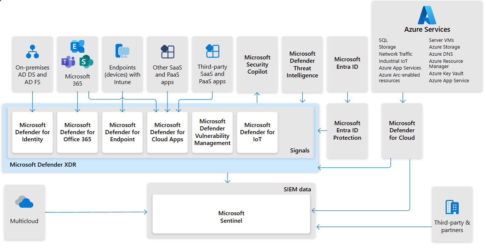
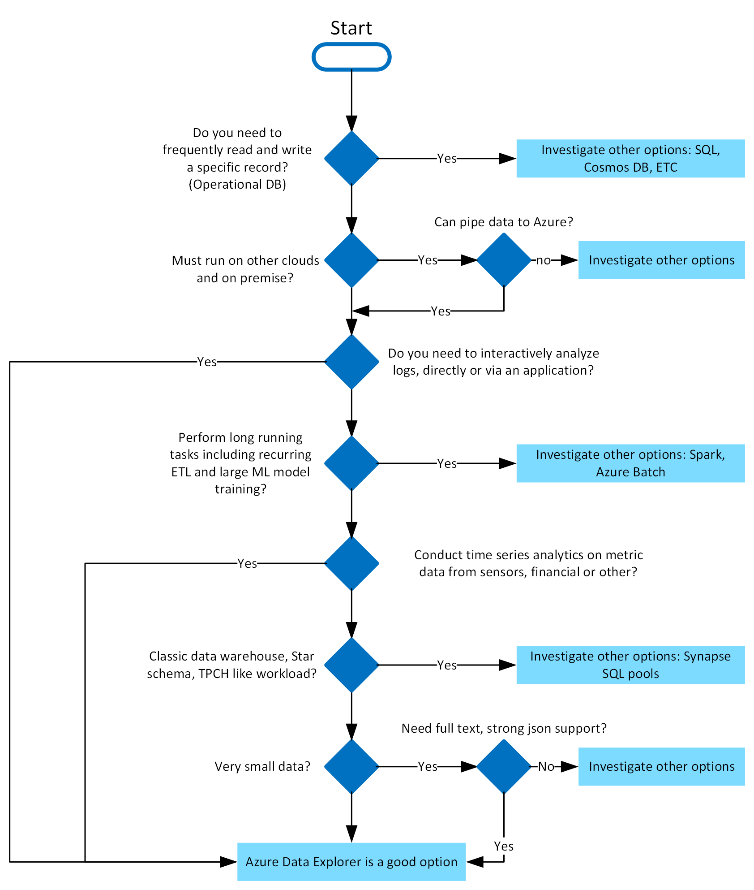
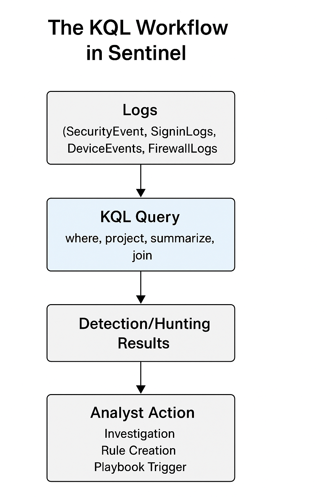

# Day 7 – KQL Basics (Detection Engineering Foundation)

## Objective

Learn **Kusto Query Language (KQL)** fundamentals used by SOC analysts and detection engineers to analyze security telemetry in **Microsoft Sentinel and Log Analytics**.

By the end of this module you should be able to:

- Read and understand KQL queries
- Filter security logs
- Extract useful investigation data
- Build simple detection logic
- Think like a **detection engineer**

This day marks the transition from **SOC architecture understanding (Week 1)** to **active security detection engineering (Week 2)**.

---

# Connecting to Week 1 – Detection Pipeline

In Week 1 we learned the **enterprise SOC detection pipeline**.

```
Endpoint Activity
↓
Microsoft Defender Telemetry
↓
Log Analytics Workspace
↓
Microsoft Sentinel Analytics Rule
↓
Alert
↓
Incident
↓
SOC Investigation
↓
ServiceNow Ticket
```

During **SOC investigations**, analysts must query security telemetry stored inside **Log Analytics tables**.



This is where **KQL becomes essential**.

SOC analysts use KQL to:

- search logs  
- detect suspicious behavior  
- investigate alerts  
- build detection rules  
- perform threat hunting  

Without KQL, **Microsoft Sentinel cannot be effectively used**.

---

# What is KQL?

**KQL (Kusto Query Language)** is a **read-only query language** used to analyze large volumes of log data.

It is widely used across Microsoft security platforms:

- Microsoft Sentinel
- Azure Log Analytics
- Microsoft Defender
- Azure Data Explorer

KQL allows analysts to:

- search millions of security events
- filter suspicious activity
- correlate events
- detect attack patterns

KQL is designed to be:

- simple
- fast
- readable
- optimized for log analytics



---

# Where KQL is Used in Enterprise SOC

KQL is used in several stages of SOC operations.

## Detection Engineering

Create **analytics rules** that generate alerts.

```kql
SigninLogs
| where ResultType != 0
```

---

## Threat Hunting

Search logs for suspicious patterns.

```kql
DeviceProcessEvents
| where ProcessCommandLine contains "powershell"
```

---

## Incident Investigation

Investigate alerts and suspicious activity.

```kql
SecurityEvent
| where Account == "admin"
```

---

## Forensic Analysis

Reconstruct attacker timelines.

```kql
DeviceEvents
| order by TimeGenerated desc
```



---

# KQL Query Structure

Most KQL queries follow a simple structure.

```
TableName
| operator
| operator
| operator
```

Example:

```kql
SigninLogs
| where ResultType != 0
| project TimeGenerated, UserPrincipalName, IPAddress
```

Explanation:

1. **Table** – source of logs  
2. **Operators** – process and filter data  
3. **Output** – results returned to analyst  

---

# Understanding Log Tables

Security logs inside Log Analytics are stored in **tables**.

Common SOC tables:

| Table | Description |
|------|-------------|
| SigninLogs | Azure AD authentication logs |
| SecurityEvent | Windows security events |
| DeviceEvents | Defender endpoint telemetry |
| DeviceProcessEvents | Process execution logs |
| AzureActivity | Azure control plane actions |
| OfficeActivity | Microsoft 365 activity |

Example query:

```kql
SecurityEvent
| limit 10
```

This shows the **first 10 Windows security events**.

---

# Core KQL Operators

The most important beginner operators are:

- `where`
- `project`
- `limit`
- `distinct`
- `count`

These operators form the **foundation of detection engineering**.

---

# Operator – where

### Purpose

Filters logs based on conditions.

Example:

```kql
SigninLogs
| where ResultType != 0
```

This returns **failed login attempts**.

---

Example: login attempts from specific IP

```kql
SigninLogs
| where IPAddress == "192.168.1.5"
```

---

Example: specific user activity

```kql
SigninLogs
| where UserPrincipalName == "admin@company.com"
```

---

Example: PowerShell execution

```kql
DeviceProcessEvents
| where ProcessCommandLine contains "powershell"
```

---

# Operator – project

### Purpose

Select specific columns from results.

Example:

```kql
SigninLogs
| project TimeGenerated, UserPrincipalName, IPAddress
```

This removes unnecessary columns.

---

Example investigation query:

```kql
SigninLogs
| where ResultType != 0
| project TimeGenerated, UserPrincipalName, IPAddress, AppDisplayName
```

This helps analysts see:

- login time
- user
- source IP
- application used

---

# Operator – limit

### Purpose

Limits number of results returned.

Example:

```kql
SigninLogs
| limit 10
```

Useful for **previewing log data quickly**.

---

# Operator – distinct

### Purpose

Returns **unique values**.

Example:

```kql
SigninLogs
| distinct IPAddress
```

Unique login IP addresses.

---

Example:

```kql
SigninLogs
| distinct UserPrincipalName
```

Unique users in the dataset.

---

Example:

```kql
DeviceProcessEvents
| distinct FileName
```

Unique processes executed.

---

# Operator – count

### Purpose

Counts number of records.

Example:

```kql
SigninLogs
| count
```

Returns total login events.

---

Count failed logins:

```kql
SigninLogs
| where ResultType != 0
| count
```

---

# Combining Operators

Real SOC queries combine multiple operators.

Example:

```kql
SigninLogs
| where ResultType != 0
| project TimeGenerated, UserPrincipalName, IPAddress
| limit 20
```

This shows **recent failed login attempts**.

---

# Example SOC Investigation Queries

## Failed Logins

```kql
SigninLogs
| where ResultType != 0
| project TimeGenerated, UserPrincipalName, IPAddress
```

---

## Login Attempts from Specific IP

```kql
SigninLogs
| where IPAddress == "8.8.8.8"
```

---

## PowerShell Activity

```kql
DeviceProcessEvents
| where ProcessCommandLine contains "powershell"
```

---

## Unique Login Locations

```kql
SigninLogs
| distinct Location
```

---

## Recent Windows Security Events

```kql
SecurityEvent
| limit 50
```

---

# Detection Engineering Thinking

Detection engineers ask:

> What activity indicates an attack?

Example indicator:

```
Multiple failed login attempts
```

Query idea:

```kql
SigninLogs
| where ResultType != 0
```

Later we enhance detections using:

- `summarize`
- `bin()`
- thresholds

These will be covered in **Day 8 – Aggregation Queries**.

---

# Investigation Workflow Using KQL

Example alert:

```
Multiple failed login attempts detected
```

SOC analyst workflow:

### Step 1 – Query failed login events

```kql
SigninLogs
| where ResultType != 0
```

---

### Step 2 – Identify affected user

```kql
| project UserPrincipalName
```

---

### Step 3 – Identify source IP

```kql
| project IPAddress
```

---

### Step 4 – Check login location

---

### Step 5 – Determine if malicious or user error

---

# Common Attack Scenarios Using KQL

## Brute Force Attacks

```kql
SigninLogs
| where ResultType != 0
```

---

## Suspicious PowerShell Execution

```kql
DeviceProcessEvents
| where ProcessCommandLine contains "powershell"
```

---

## Suspicious Azure Resource Deletion

```kql
AzureActivity
| where OperationName contains "Delete"
```

---

## Privileged Role Assignment

```kql
AuditLogs
| where ActivityDisplayName contains "Add member to role"
```

---

# SOC Analyst Responsibilities

## L1 SOC Analyst

Responsibilities:

- alert triage
- basic investigation
- log analysis

Example query:

```kql
SigninLogs
| where UserPrincipalName == "user@company.com"
```

---

## L2 SOC Analyst

Responsibilities:

- detection engineering
- log correlation
- threat hunting
- detection tuning

---

# False Positive Considerations

Not all suspicious logs are malicious.

Failed logins may occur due to:

- wrong password
- expired credentials
- VPN reconnect attempts
- mobile login retries

SOC analysts must analyze **context before escalation**.

---

# Detection Tuning

Enterprise SOC teams reduce alert noise.

Exclude trusted IP ranges:

```kql
| where IPAddress !in ("10.0.0.1","10.0.0.2")
```

Exclude service accounts:

```kql
| where UserPrincipalName !contains "svc"
```

---

# Key Terminology

Important KQL terms:

- KQL
- Log Analytics
- Query Operator
- Pipeline Operator `|`
- Table
- Filter
- Projection
- Aggregation

---

# Interview Talking Points

### 1

KQL is the primary language used to query **security telemetry stored in Log Analytics and Microsoft Sentinel**.

---

### 2

SOC analysts use KQL for:

- alert investigation
- threat hunting
- detection engineering

---

### 3

KQL queries start with a **table followed by pipeline operators**.

Example:

```kql
SigninLogs
| where ResultType != 0
```

---

### 4

Operators such as **where, project, distinct, and count** are fundamental for analyzing security events.

---

### 5

Detection engineers embed KQL queries into **Sentinel Analytics Rules** to automatically generate alerts.

---

# Key Takeaways

- KQL is the **core query language used in Microsoft Sentinel**
- SOC analysts rely on KQL for investigations
- Detection engineers use KQL to build **security analytics rules**
- KQL enables threat hunting and attack detection

Mastering KQL allows SOC analysts to:

- detect attacks
- investigate incidents
- perform threat hunting
- build detection logic