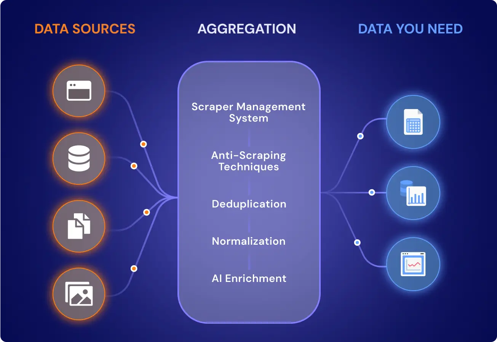
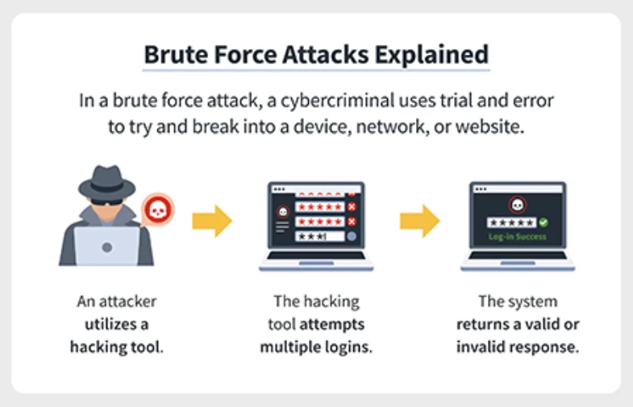

# Day 8 – Aggregation Queries (KQL Deep Dive)

This module focuses on **Aggregation Queries in Kusto Query Language (KQL)**. Aggregations are used to **summarize large datasets, detect patterns, and identify anomalies** such as brute force login attempts, spikes in activity, or unusual behaviors.

By the end of this module you will be able to:

* Aggregate massive log datasets efficiently
* Detect anomalies and patterns
* Use time bucketing for behavioral analysis
* Combine filters and aggregations for security investigations
* Build detection-style queries used in SOC environments



---

# 1. What Are Aggregation Queries?

Aggregation queries **compress large datasets into summarized insights**.

Instead of showing every log entry, aggregation answers questions like:

* How many failed logins happened?
* Which IP generated the most alerts?
* How many events occurred every 5 minutes?
* What is the average response time?

Example:

```kql
SigninLogs
| summarize count()
```

This returns the **total number of rows** in the dataset.

Without aggregation you might get **millions of rows**.
Aggregation reduces it to **a single useful number**.

---

# 2. The `summarize` Operator

`summarize` is the **core aggregation operator in KQL**.

It groups data and applies **aggregation functions**.

Basic syntax:

```kql
TableName
| summarize AggregationFunction(ColumnName)
```

Example:

```kql
SigninLogs
| summarize count()
```

Output:

| count_ |
| ------ |
| 15234  |

Meaning **15234 records exist in the dataset**.

---

# 3. Grouping Data with `summarize`

Most real investigations require grouping.

Syntax:

```kql
| summarize Aggregation by ColumnName
```

Example:

```kql
SigninLogs
| summarize count() by IPAddress
```

Output:

| IPAddress   | count_ |
| ----------- | ------ |
| 10.1.1.1    | 45     |
| 8.8.8.8     | 12     |
| 192.168.1.5 | 90     |

This shows **how many sign-in attempts came from each IP**.

This is **extremely useful in security analysis**.

---

# 4. Common Aggregation Functions

## count()

Counts rows.

```kql
SigninLogs
| summarize TotalAttempts=count()
```

---

## dcount()

Counts **distinct values**.

Example:

```kql
SigninLogs
| summarize UniqueIPs=dcount(IPAddress)
```

Useful for detecting:

* scanning activity
* distributed attacks

---

## sum()

Adds numeric values.

Example:

```kql
SecurityEvent
| summarize TotalBytes=sum(BytesTransferred)
```

---

## avg()

Calculates averages.

```kql
PerformanceLogs
| summarize AvgResponse=avg(ResponseTime)
```

---

## min() and max()

Find smallest or largest values.

```kql
SigninLogs
| summarize FirstSeen=min(TimeGenerated), LastSeen=max(TimeGenerated) by IPAddress
```

This helps determine **activity duration of an attacker**.

---

# 5. Multiple Aggregations

You can run multiple aggregations in the same query.

Example:

```kql
SigninLogs
| summarize
    TotalAttempts=count(),
    UniqueUsers=dcount(UserPrincipalName),
    FirstSeen=min(TimeGenerated),
    LastSeen=max(TimeGenerated)
by IPAddress
```

This produces **a compact behavioral summary per IP**.

---

# 6. Time Bucketing with `bin()`

`bin()` groups timestamps into **time intervals**.

Syntax:

```kql
bin(TimeColumn, interval)
```

Example:

```kql
SigninLogs
| summarize count() by bin(TimeGenerated, 5m)
```

Output example:

| TimeGenerated | count_ |
| ------------- | ------ |
| 10:00         | 120    |
| 10:05         | 98     |
| 10:10         | 110    |

Instead of **every second**, logs are grouped into **5-minute buckets**.

This is critical for:

* trend analysis
* spike detection
* brute force detection

---

# 7. Aggregation + Filtering Workflow

Typical investigation flow:

1. Filter relevant logs
2. Aggregate results
3. Detect anomalies

Example:

```kql
SigninLogs
| where ResultType != 0
| summarize count() by IPAddress
| where count_ > 10
```

Steps explained:

1️⃣ Filter failed logins
2️⃣ Count attempts per IP
3️⃣ Show only suspicious IPs

---

# 8. Brute Force Detection Example

Example detection query:

```kql
SigninLogs
| where ResultType != 0
| summarize FailedAttempts=count() by IPAddress, bin(TimeGenerated,5m)
| where FailedAttempts > 10
```

Explanation:

```
SigninLogs
```

Dataset containing login activity.

```
| where ResultType != 0
```

Filter failed authentication attempts.

```
| summarize FailedAttempts=count()
```

Count failed attempts.

```
by IPAddress, bin(TimeGenerated,5m)
```

Group by:

* attacker IP
* 5-minute window

```
| where FailedAttempts > 10
```

Only show suspicious activity.

This identifies **possible brute-force attacks**.



---

# 9. Detecting Password Spray Attacks

Password spraying uses **one password against many users**.

Detection query:

```kql
SigninLogs
| where ResultType != 0
| summarize FailedAttempts=count(), TargetedUsers=dcount(UserPrincipalName)
by IPAddress, bin(TimeGenerated,10m)
| where FailedAttempts > 20 and TargetedUsers > 10
```

Indicators:

* many failures
* many different users
* same IP

---

# 10. Detecting Suspicious Login Spikes

```kql
SigninLogs
| summarize Attempts=count() by bin(TimeGenerated, 10m)
| where Attempts > 500
```

This identifies **login storms** or automation activity.

---

# 11. Finding Most Active Attackers

```kql
SigninLogs
| where ResultType != 0
| summarize FailedAttempts=count() by IPAddress
| sort by FailedAttempts desc
```

This ranks **top attacking IPs**.

---

# 12. Combining Aggregation + Sorting

Example:

```kql
SigninLogs
| summarize Attempts=count() by IPAddress
| sort by Attempts desc
| take 10
```

Returns the **top 10 most active IPs**.

---

# 13. Aggregating by Multiple Dimensions

Example:

```kql
SigninLogs
| summarize Attempts=count()
by IPAddress, AppDisplayName
```

This shows:

| IP | Application | Attempts |

Useful for seeing **which apps attackers target**.

---

# 14. Aggregation for Incident Investigation

Example investigation query:

```kql
SigninLogs
| where ResultType != 0
| summarize
    FailedAttempts=count(),
    UsersTargeted=dcount(UserPrincipalName),
    FirstSeen=min(TimeGenerated),
    LastSeen=max(TimeGenerated)
by IPAddress
| sort by FailedAttempts desc
```

This gives a **complete attacker profile**.

---

# 15. Performance Tips for Aggregation Queries

## Filter First

Bad:

```kql
SigninLogs
| summarize count() by IPAddress
| where ResultType != 0
```

Good:

```kql
SigninLogs
| where ResultType != 0
| summarize count() by IPAddress
```

Filtering first reduces data scanned.

---

## Limit Time Range

Example:

```kql
SigninLogs
| where TimeGenerated > ago(24h)
| summarize count()
```

Always **limit the timeframe** in large environments.

---

# 16. Real SOC Use Cases

Aggregation queries are used to detect:

### Brute force attacks

Multiple failures from same IP.

### Password spraying

Many users targeted by same IP.

### Credential stuffing

Large authentication bursts.

### Insider activity

Unusual login spikes.

### Bot activity

High-frequency requests.

---

# 17. Practice Queries

### Exercise 1

Count total sign-ins.

```kql
SigninLogs
| summarize count()
```

---

### Exercise 2

Count failures per IP.

```kql
SigninLogs
| where ResultType != 0
| summarize Failed=count() by IPAddress
```

---

### Exercise 3

Show login activity every 5 minutes.

```kql
SigninLogs
| summarize count() by bin(TimeGenerated,5m)
```

---

### Exercise 4

Find suspicious login bursts.

```kql
SigninLogs
| where ResultType != 0
| summarize Failed=count() by IPAddress, bin(TimeGenerated,5m)
| where Failed > 20
```

---

# 18. Key Takeaways

Aggregation queries allow analysts to:

* Reduce millions of logs into meaningful summaries
* Detect anomalies and attack patterns
* Monitor login trends
* Build security detections

Core components learned:

* `summarize`
* `count()`
* `dcount()`
* `sum()`
* `avg()`
* `min()` / `max()`
* `bin()`

These are **essential skills for KQL-based threat detection**.

---

# 19. Next Skills to Learn

To build powerful detection queries, the next concepts usually follow:

* `extend`
* `project`
* `join`
* `make-series`
* `mv-expand`

These allow you to build **advanced threat hunting queries**.

---

# End of Day 8

Aggregation Queries Mastery
