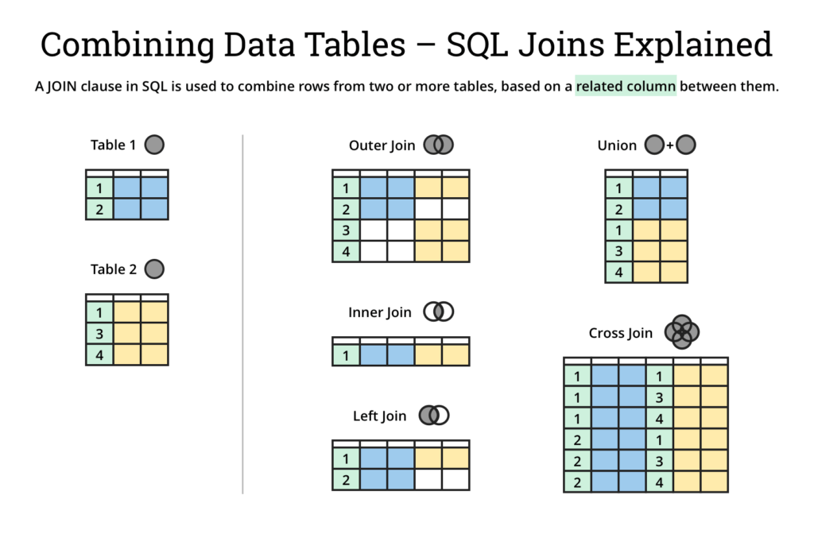
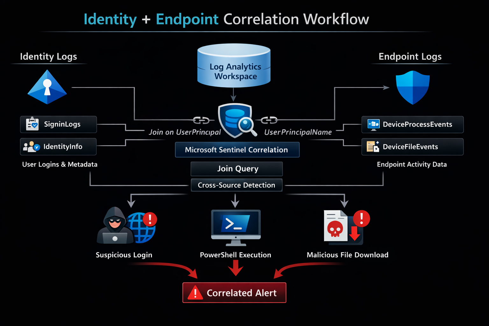

# Day 9 – KQL Join Queries (Multi-Table Correlation)

## Objective

Understand how **KQL join queries** are used in Microsoft Sentinel to correlate events across multiple log sources.

Join queries allow SOC analysts and detection engineers to **combine identity, endpoint, and cloud telemetry** to detect complex attack behavior.

This concept is fundamental to **enterprise detection engineering**, because real attacks rarely appear in a single log source.

---

# Connection to Previous Day

### Day 7
Learned basic KQL operators:

- where
- project
- distinct
- count

### Day 8
Learned aggregation queries:

- summarize
- bin()
- threshold detection

Example:

```
SigninLogs
| where ResultType != 0
| summarize FailedAttempts=count() by IPAddress, bin(TimeGenerated,5m)
| where FailedAttempts > 10
```

This detects **brute force login attempts**.

However this still analyzes **one log table only**.

---

# Why Day 9 Matters

Enterprise attacks involve **multiple systems**.

Example:

```
User login
↓
Endpoint activity
↓
Privilege escalation
↓
Lateral movement
```

These events appear in **different telemetry sources**.

| Activity | Log Table |
|--------|--------|
Login attempt | SigninLogs
User metadata | IdentityInfo
Endpoint process | DeviceProcessEvents
Cloud activity | AzureActivity

To investigate attacks properly, SOC analysts must **correlate logs across tables**.

This is where **KQL joins** are used.

---

# Concept Overview

A **join** combines data from two tables using a **common field**.

Example:

```
SigninLogs
| join IdentityInfo on UserPrincipalName
```

This query merges:

```
SigninLogs
+
IdentityInfo
```

Using:

```
UserPrincipalName
```

as the **linking key**.



---

# Why Join Queries Exist in Enterprise Security

Security events are **distributed across systems**.

Examples:

| System | Telemetry |
|------|------|
Microsoft Entra ID | login activity
Microsoft Defender | endpoint activity
Azure | resource activity
Office365 | email activity

Attack investigations require **correlating these logs**.

Example attack chain:

```
Suspicious login
↓
PowerShell execution
↓
Credential dumping
↓
Lateral movement
```

Each stage appears in **different tables**.

Join queries enable detection rules to **connect these activities**.

---

# Architecture Context

Join queries operate within the **Microsoft security telemetry pipeline**.

```
Endpoint Activity
↓
Microsoft Defender Telemetry
↓
Log Analytics Workspace
↓
Microsoft Sentinel KQL Query
↓
Join Correlation
↓
Detection Rule
↓
Alert
↓
Incident
↓
SOC Investigation
```

Join queries run **inside Sentinel analytics rules or hunting queries**.



---

# Core Components of Join Queries

### Table 1

Primary dataset.

Example:

```
SigninLogs
```

Contains:

- login attempts
- authentication results
- IP addresses
- user accounts

---

### Table 2

Secondary dataset providing **additional context**.

Example:

```
IdentityInfo
```

Contains:

- user department
- account status
- role
- group membership

---

### Join Key

The column used to match rows.

Example:

```
UserPrincipalName
```

---

# Example Join Query

```
SigninLogs
| join IdentityInfo on UserPrincipalName
```

This query returns:

- login events
- user role
- department
- identity attributes

Combined together.

---

# Visualization of Join Correlation

```
SigninLogs Table

UserPrincipalName     IPAddress        Result
---------------------------------------------
alice@corp.com        10.10.1.5        Success
bob@corp.com          45.12.88.4       Failure
charlie@corp.com      66.23.4.8        Success


IdentityInfo Table

UserPrincipalName     Department       Role
---------------------------------------------
alice@corp.com        Finance          Manager
bob@corp.com          IT               Admin
charlie@corp.com      HR               User


Join Result

UserPrincipalName     IPAddress      Result     Department     Role
------------------------------------------------------------------
alice@corp.com        10.10.1.5      Success    Finance        Manager
bob@corp.com          45.12.88.4     Failure    IT             Admin
charlie@corp.com      66.23.4.8      Success    HR             User
```

Now analysts see **login activity + user context together**.

---

# Join Types in KQL

Different join types control **how rows are matched**.

---

## Inner Join

Default join type.

Returns only records that exist in **both tables**.

Example:

```
SigninLogs
| join kind=inner IdentityInfo on UserPrincipalName
```

Used when:

- matching records must exist in both datasets.

---

## Left Outer Join

Returns:

- all records from the left table
- matched records from the right table

Example:

```
SigninLogs
| join kind=leftouter IdentityInfo on UserPrincipalName
```

Useful when:

- some users may not exist in identity table.

---

## Right Outer Join

Opposite of left join.

Used less frequently in security detection.

---

## Full Outer Join

Returns all records from both tables.

Used mainly in **data exploration**.

---

# Example Detection: Suspicious Login With Identity Context

Detection idea:

Identify failed logins and enrich them with identity metadata.

```
SigninLogs
| where ResultType != 0
| join kind=inner IdentityInfo on UserPrincipalName
| project TimeGenerated, UserPrincipalName, IPAddress, Department, JobTitle
```

This allows analysts to see:

- which department user belongs to
- whether account is privileged
- which IP performed the login

---

# Advanced Example – Brute Force + Identity Correlation

```
SigninLogs
| where ResultType != 0
| summarize FailedAttempts=count() by UserPrincipalName, IPAddress, bin(TimeGenerated,5m)
| where FailedAttempts > 10
| join kind=inner IdentityInfo on UserPrincipalName
```

This detection now provides:

- brute force attempts
- user metadata
- identity role

This improves **alert investigation context**.

---

# Multi-Source Correlation Example

Real SOC detections often correlate **identity + endpoint telemetry**.

Example scenario:

```
Suspicious login
↓
PowerShell execution on device
```

Query example:

```
SigninLogs
| where ResultType == 0
| join DeviceProcessEvents on AccountName
| where ProcessCommandLine contains "powershell"
```

This correlates:

```
Identity login
+
Endpoint process execution
```

This is **cross-source detection**.

---

# Investigation Workflow Using Join Queries

When a detection triggers, SOC analysts correlate logs.

Typical workflow:

```
Alert triggered
↓
Review login activity
↓
Correlate identity metadata
↓
Check endpoint activity
↓
Check cloud activity
↓
Build attack timeline
```

Join queries help reconstruct:

```
who
did what
from where
on which system
```

---

# Real Attack Scenario

Example: **Account Compromise**

```
Attacker steals credentials
↓
Suspicious login from foreign IP
↓
PowerShell executed
↓
Data exfiltration
```

Relevant logs:

| Event | Table |
|------|------|
Login | SigninLogs
User metadata | IdentityInfo
Endpoint activity | DeviceProcessEvents
Cloud access | AzureActivity

Join queries correlate these datasets.

---

# SOC Analyst Responsibilities

## L1 Analyst

Tasks:

- review alert
- analyze login activity
- identify user involved
- check IP reputation
- escalate if suspicious

Join queries help L1 analysts **view enriched alerts**.

---

## L2 Analyst

Tasks:

- write detection queries
- correlate logs
- tune detection rules
- identify attack patterns

L2 analysts use join queries heavily in **detection engineering**.

---

# Common False Positives

Join-based detections may trigger during legitimate activity.

Examples:

### VPN Logins

Employees logging in through VPN may appear suspicious.

---

### Admin Scripts

Automated scripts may generate login + PowerShell activity.

---

### IT Maintenance

Admin tasks may produce correlated events.

---

# Detection Tuning Strategies

SOC teams tune join detections by excluding:

### Trusted IP ranges

```
| where IPAddress !in ("corp-vpn-range")
```

---

### Service Accounts

```
| where UserPrincipalName !contains "svc"
```

---

### Known admin activity

Exclude IT automation scripts.

---

# Key Terminology

Important concepts:

Join Query  
Multi-table correlation  
Inner Join  
Left Outer Join  
Correlation Key  
Detection Enrichment  
Cross-Source Detection  
Telemetry Correlation  
Detection Engineering

---

# Interview Talking Points

Strong explanations for SOC interviews:

1. Join queries allow SOC analysts to **correlate telemetry from multiple log sources**.

2. Real attacks involve multiple systems, so **single-table detections are often insufficient**.

3. Join queries are commonly used to correlate **identity logs with endpoint telemetry**.

4. In Microsoft Sentinel, joins help enrich detections with **user metadata, device data, or threat intelligence**.

5. Detection engineers use joins to build **behavior-based detections across security domains**.

---

# GitHub Documentation Section

## Day 9 – KQL Join Queries

### Objective

Understand how KQL joins enable correlation between multiple security telemetry sources.

### Architecture Context

```
Endpoint
↓
Microsoft Defender
↓
Log Analytics Workspace
↓
Sentinel KQL Join Query
↓
Alert
↓
Incident
↓
SOC Investigation
```

### Core Concept

Join queries merge data from multiple tables using a shared column.

Example:

```
SigninLogs
| join IdentityInfo on UserPrincipalName
```

### Why It Matters

Enterprise attacks generate telemetry across systems.  
Join queries allow analysts to **reconstruct attack chains across logs**.

### Example Detection

```
SigninLogs
| where ResultType != 0
| join kind=inner IdentityInfo on UserPrincipalName
| project TimeGenerated, UserPrincipalName, IPAddress, Department
```

### Key Takeaways

- Join queries enable **multi-table security correlation**
- Used heavily in **Sentinel detections and threat hunting**
- Critical skill for **SOC detection engineering**
- Allows analysts to correlate **identity, endpoint, and cloud telemetry**

---

---

# 5 Real Enterprise Join Detections Used in SOC

In enterprise SOC environments, join queries are used to detect **multi-stage attacks** by correlating activity across security telemetry sources.

These detections simulate how **real attackers move through environments**.

Typical attack chain:

```
Credential Theft
↓
Suspicious Login
↓
Endpoint Execution
↓
Privilege Escalation
↓
Lateral Movement
```

Join queries help correlate these stages.

---

# Detection 1 – Suspicious Login + Endpoint PowerShell Execution

## Detection Idea

Detect a user login followed by **PowerShell execution on a device** shortly after.

This may indicate:

- attacker logged in
- executed remote commands
- began post-exploitation

---

## Log Sources

| Source | Table |
|------|------|
Identity login | SigninLogs
Endpoint process execution | DeviceProcessEvents

---

## Detection Query

```
SigninLogs
| where ResultType == 0
| project TimeGenerated, UserPrincipalName, IPAddress
| join kind=inner (
    DeviceProcessEvents
    | where ProcessCommandLine contains "powershell"
    | project DeviceName, AccountName, ProcessCommandLine, TimeGenerated
) on $left.UserPrincipalName == $right.AccountName
```

---

## Detection Logic

```
Successful login
+
PowerShell execution
=
Possible attacker activity
```

---

## Investigation Questions

SOC analysts ask:

- Did the user normally run PowerShell?
- Is the login IP trusted?
- Is the command suspicious?

---

# Detection 2 – Failed Logins + Successful Login (Brute Force Success)

## Detection Idea

Detect when multiple failed logins are followed by a successful login.

This indicates **possible password guessing or brute force attack**.

---

## Log Sources

| Source | Table |
|------|------|
Login telemetry | SigninLogs
Identity metadata | IdentityInfo

---

## Detection Query

```
let FailedAttempts =
SigninLogs
| where ResultType != 0
| summarize FailedCount=count() by UserPrincipalName, IPAddress, bin(TimeGenerated,10m)
| where FailedCount > 5;

let SuccessfulLogin =
SigninLogs
| where ResultType == 0;

FailedAttempts
| join kind=inner SuccessfulLogin on UserPrincipalName
| join kind=inner IdentityInfo on UserPrincipalName
```

---

## Detection Logic

```
Multiple failed attempts
↓
Successful login
↓
Possible credential compromise
```

---

## Investigation Questions

SOC analyst verifies:

- Did login come from same IP?
- Is IP reputation suspicious?
- Did user activity increase after login?

---

# Detection 3 – Suspicious Login + Azure Privilege Assignment

## Detection Idea

Detect a login followed by **privilege escalation in Azure**.

Example attack:

```
Account compromise
↓
Login to Azure portal
↓
Assign owner privileges
```

---

## Log Sources

| Source | Table |
|------|------|
Identity login | SigninLogs
Cloud activity | AzureActivity

---

## Detection Query

```
SigninLogs
| where ResultType == 0
| join kind=inner (
    AzureActivity
    | where OperationNameValue contains "roleAssignments"
) on UserPrincipalName
```

---

## Detection Logic

```
User login
+
Role assignment activity
=
Possible privilege escalation
```

---

## Investigation Questions

- Is the user normally assigning roles?
- Was this a high privilege role?
- Was activity approved?

---

# Detection 4 – Suspicious Login + Email Access

## Detection Idea

Detect suspicious login followed by mailbox access.

Example attack:

```
Credential theft
↓
Mailbox access
↓
Email exfiltration
```

---

## Log Sources

| Source | Table |
|------|------|
Identity login | SigninLogs
Email activity | OfficeActivity

---

## Detection Query

```
SigninLogs
| where ResultType == 0
| join kind=inner (
    OfficeActivity
    | where Operation == "MailItemsAccessed"
) on UserPrincipalName
```

---

## Detection Logic

```
External login
+
Mailbox access
=
Possible email compromise
```

---

## Investigation Questions

- Was login location unusual?
- Did mailbox rules change?
- Were emails downloaded?

---

# Detection 5 – Suspicious Login + Device File Download

## Detection Idea

Detect login followed by suspicious file download on endpoint.

Possible attacker behavior:

```
Login
↓
Download malicious tool
↓
Execute malware
```

---

## Log Sources

| Source | Table |
|------|------|
Login events | SigninLogs
File events | DeviceFileEvents

---

## Detection Query

```
SigninLogs
| where ResultType == 0
| join kind=inner (
    DeviceFileEvents
    | where FileName endswith ".exe"
) on UserPrincipalName
```

---

## Detection Logic

```
Login
+
Executable download
=
Potential malware deployment
```

---

# Why These Detections Matter

Single-table detections identify **isolated events**.

Join detections identify **attack sequences**.

```
Login
+
Process execution
+
Privilege escalation
=
Attack pattern
```

This is how **enterprise detection engineering works**.

---

# Advanced Join Patterns Used by Detection Engineers

These patterns are used in **real enterprise SOC environments**.

Many analysts never learn them, but they are extremely powerful.

---

# Pattern 1 – Time-Based Join Correlation

Attack events often happen **within a short time window**.

Detection engineers correlate events using timestamps.

---

## Example

```
SigninLogs
| where ResultType == 0
| join kind=inner (
    DeviceProcessEvents
    | where ProcessCommandLine contains "powershell"
) on UserPrincipalName
| where abs(datetime_diff("minute", TimeGenerated, TimeGenerated1)) < 5
```

---

## Detection Logic

```
Login
↓ within 5 minutes
PowerShell execution
```

This helps detect **post-login attacker activity**.

---

# Pattern 2 – Join With Threat Intelligence

SOC teams correlate logs with **threat intelligence feeds**.

---

## Example

```
SigninLogs
| join kind=inner ThreatIntelligenceIndicator on IPAddress
```

---

## Detection Logic

```
Login IP
+
Threat intel match
=
Known malicious infrastructure
```

---

# Pattern 3 – Multi-Join Detection

Detection engineers sometimes chain multiple joins.

Example:

```
SigninLogs
+
DeviceProcessEvents
+
AzureActivity
```

---

## Query Example

```
SigninLogs
| join DeviceProcessEvents on UserPrincipalName
| join AzureActivity on UserPrincipalName
```

---

## Detection Logic

```
Login
↓
Endpoint execution
↓
Cloud privilege activity
```

This reconstructs **multi-stage attacks**.

---

# Pattern 4 – Join With Behavioral Baseline

Detect rare behavior by comparing with historical activity.

---

## Example

```
let baseline =
DeviceProcessEvents
| summarize count() by AccountName, ProcessName;

DeviceProcessEvents
| join kind=leftanti baseline on AccountName
```

---

## Detection Logic

```
Process never executed before
↓
Possible attacker tool
```

---

# Pattern 5 – Anti Join (Rare But Powerful)

Anti joins detect **events that should exist but don't**.

---

## Example

Detect users that logged in but **have no MFA event**.

```
SigninLogs
| where ResultType == 0
| join kind=leftanti MFAEvents on UserPrincipalName
```

---

## Detection Logic

```
Login
+
No MFA verification
=
Possible bypass
```

---

# Key Detection Engineering Takeaways

Join queries enable SOC teams to detect:

- multi-stage attacks
- identity compromise
- endpoint execution
- cloud privilege escalation
- threat intelligence matches

Without joins, many **advanced attacks remain invisible**.

---

# Key Takeaways

Join queries are one of the most powerful tools in **KQL detection engineering**.

They allow SOC analysts to:

- correlate telemetry sources
- reconstruct attack timelines
- enrich alerts with context
- detect complex attack behavior

Mastering joins is essential for:

- Microsoft Sentinel detection engineering
- threat hunting
- enterprise SOC investigations

---