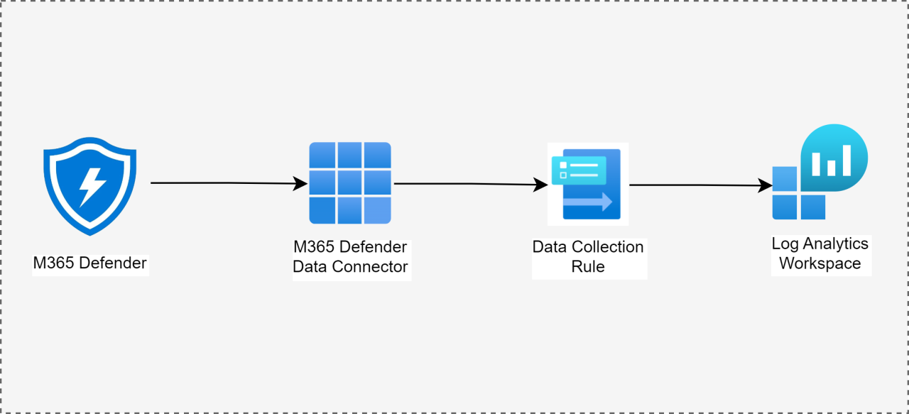
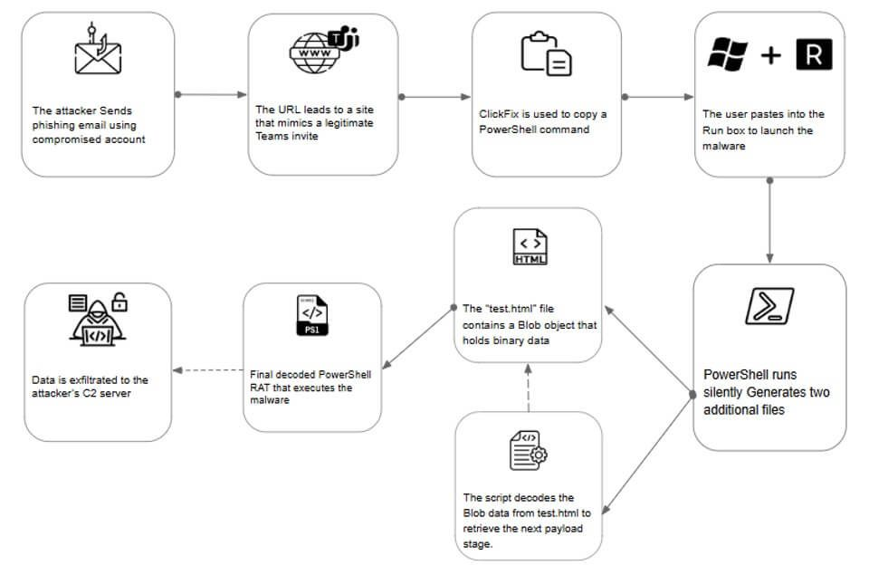
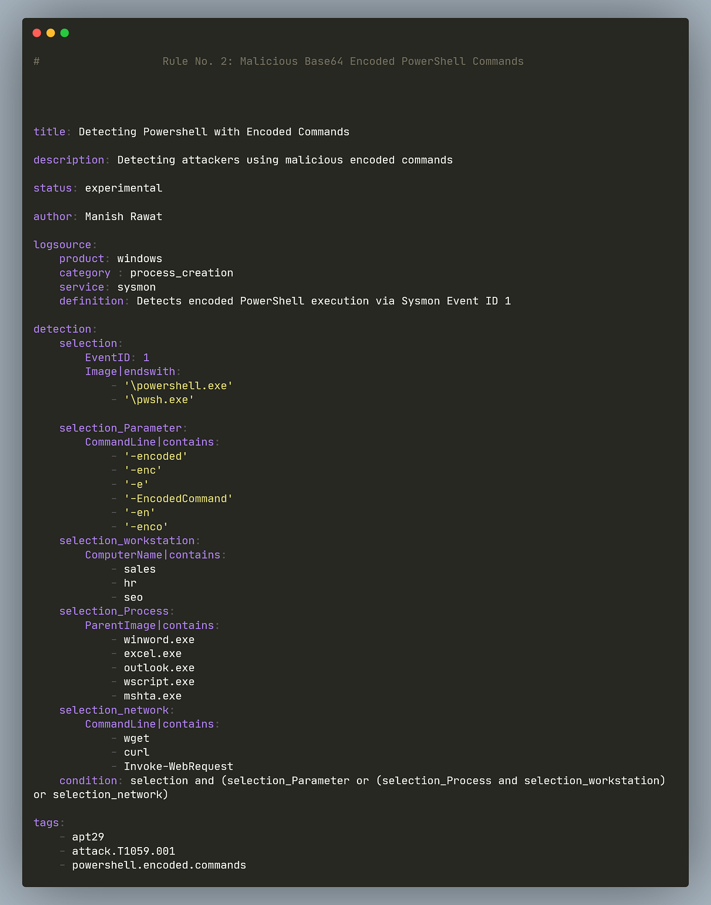

# Day 10 – Process Detection (PowerShell & Suspicious Process Activity)

## Objective

Understand how SOC analysts detect malicious process execution on endpoints using Microsoft Defender for Endpoint telemetry.

This day focuses on detecting suspicious command execution using the **DeviceProcessEvents** table in Microsoft Defender.

The goal is to understand:

• endpoint process telemetry  
• PowerShell abuse detection  
• encoded command detection  
• suspicious script execution  
• SOC investigation of process activity  

Process detection is one of the **most important SOC detection areas**, because many attacks eventually execute malicious commands on the endpoint.

---

# Architecture Context

Process telemetry originates from **endpoint systems** and flows through the Microsoft security stack.

```
Endpoint Process Execution
↓
Microsoft Defender for Endpoint
↓
DeviceProcessEvents Telemetry
↓
Log Analytics Workspace
↓
Microsoft Sentinel Analytics Rule
↓
Alert Generated
↓
Incident Created
↓
SOC Investigation
↓
ServiceNow Ticket
```

This telemetry is a core component of **Endpoint Detection and Response (EDR)**.



---

# Concept Overview

Every program executed on a device generates a **process event**.

Examples:

```
powershell.exe
cmd.exe
wscript.exe
mshta.exe
rundll32.exe
```

These processes are frequently used in attacks because they allow **command execution and scripting**.

Microsoft Defender captures this telemetry and stores it in the table:

```
DeviceProcessEvents
```

SOC analysts use this table to detect:

• malicious scripts  
• encoded commands  
• living-off-the-land attacks  
• malware execution  
• suspicious parent-child process relationships  

---

# Why Process Detection Exists in Enterprise Security

Attackers must eventually **execute code on a system**.

Even advanced attacks require a process to run.

Examples:

| Attack Stage | Process Activity |
|--------------|-----------------|
| Initial Access | macro launches PowerShell |
| Persistence | scheduled task runs script |
| Credential Theft | mimikatz execution |
| Lateral Movement | remote PowerShell |
| Data Exfiltration | script downloads data |

Because process execution is unavoidable, it is a **primary detection point in SOC environments**.

---

# Core Components

## 1. DeviceProcessEvents Table

Main endpoint telemetry for process execution.

Important fields include:

| Field | Description |
|------|-------------|
| Timestamp | Time of execution |
| DeviceName | Host where process ran |
| ProcessName | Executable name |
| ProcessCommandLine | Full command |
| InitiatingProcessName | Parent process |
| AccountName | User executing process |
| SHA256 | File hash |

This telemetry allows analysts to **reconstruct process execution chains**.

---

## 2. Process Command Line

The command line contains critical information about what the process executed.

Example:

```
powershell.exe -enc SQBFAFgAIAAoAE4AZQB3AC0ATwBiAGoAZQBjAHQAKQ==
```

Encoded commands are commonly used to hide malicious scripts.

---

## 3. Parent Process

Attack detection often relies on identifying **suspicious parent-child relationships**.

Example malicious chain:

```
winword.exe
↓
powershell.exe
↓
malware.exe
```

This pattern often indicates **malicious macro execution**.



---

# Important Attack Tools Using Processes

Attackers frequently abuse built-in Windows tools.

These are known as **Living-Off-The-Land Binaries (LOLBins)**.

Common examples:

| Tool | Purpose |
|-----|--------|
| powershell.exe | script execution |
| cmd.exe | command shell |
| rundll32.exe | run DLL payloads |
| mshta.exe | execute HTA scripts |
| wmic.exe | remote execution |
| certutil.exe | download files |

SOC detections frequently monitor these tools.

---

# Log Source

Endpoint telemetry source:

```
Microsoft Defender for Endpoint
```

Relevant tables:

```
DeviceProcessEvents
DeviceFileEvents
DeviceNetworkEvents
DeviceRegistryEvents
```

For this topic we focus primarily on:

```
DeviceProcessEvents
```

---

# Detection Logic

## Basic PowerShell Detection

Example query detecting PowerShell execution.

```
DeviceProcessEvents
| where ProcessCommandLine contains "powershell"
| project Timestamp, DeviceName, AccountName, ProcessCommandLine
```

This query identifies **systems executing PowerShell commands**.

However this detection is too broad for production environments.

SOC analysts must refine it.

---

# Encoded PowerShell Detection

Attackers often hide scripts using encoded commands.

Example detection:

```
DeviceProcessEvents
| where ProcessCommandLine contains "-enc"
or ProcessCommandLine contains "-EncodedCommand"
| project Timestamp, DeviceName, AccountName, ProcessCommandLine
```

This detection identifies **obfuscated PowerShell execution**.



---

# Suspicious Script Execution Detection

Detect scripts downloaded from the internet.

Example:

```
DeviceProcessEvents
| where ProcessCommandLine contains "IEX"
or ProcessCommandLine contains "Invoke-WebRequest"
or ProcessCommandLine contains "DownloadString"
```

This often indicates **fileless malware or remote script execution**.

---

# Parent Child Process Detection

Detect Office spawning PowerShell.

```
DeviceProcessEvents
| where InitiatingProcessName in ("winword.exe","excel.exe","outlook.exe")
| where ProcessName == "powershell.exe"
```

This pattern frequently indicates **malicious macro activity**.

---

# Investigation Workflow

When a process alert triggers, a SOC analyst investigates using the following approach.

## Step 1 – Identify the Host

Determine which device executed the process.

```
DeviceName
```

---

## Step 2 – Identify the User

Determine which account ran the process.

```
AccountName
```

Check if it is:

• administrator  
• service account  
• regular user  

---

## Step 3 – Examine Command Line

The command line reveals what the script actually executed.

Look for:

• encoded commands  
• download commands  
• suspicious URLs  

---

## Step 4 – Examine Parent Process

Check how the process started.

Example chain:

```
winword.exe
↓
powershell.exe
```

This indicates potential **macro-based malware execution**.

---

## Step 5 – Investigate Device Timeline

Using Microsoft Defender device timeline:

Look for:

• additional commands  
• network connections  
• file downloads  

---

## Step 6 – Check Threat Intelligence

If command downloads a file:

Investigate:

• domain reputation  
• IP reputation  
• file hash reputation  

---

# Real Attack Scenario

Example phishing attack chain.

```
Phishing Email
↓
User opens Word document
↓
Macro executes PowerShell
↓
PowerShell downloads malware
↓
Malware executes
```

SOC detection occurs when **PowerShell command execution is logged in DeviceProcessEvents**.

---

# SOC Analyst Responsibilities

## L1 SOC Analyst

Responsibilities:

• triage alert  
• check command line  
• verify user activity  
• determine suspicious behavior  
• escalate if malicious

---

## L2 SOC Analyst

Responsibilities:

• deep endpoint investigation  
• analyze process tree  
• confirm attacker activity  
• create new detection rules  
• tune false positives

---

# False Positives

Legitimate activity may trigger detections.

Examples:

• IT automation scripts  
• configuration management tools  
• security scanning tools  
• system administrators running PowerShell

SOC analysts must validate whether activity is **expected administrative behavior**.

---

# Detection Tuning Strategy

Enterprise SOC environments reduce false positives by tuning detections.

Example tuning strategies:

### Exclude IT automation systems

```
| where DeviceName !contains "admin-server"
```

---

### Exclude trusted service accounts

```
| where AccountName != "ITAutomationService"
```

---

### Detect only encoded commands

Encoded PowerShell is more suspicious than normal usage.

---

# Key Terminology

Important SOC terms related to process detection:

```
DeviceProcessEvents
Process Command Line
Parent Process
Child Process
Living-Off-The-Land Binaries
PowerShell Abuse
Encoded Command
Process Tree
Endpoint Telemetry
EDR Detection
```

---

# Interview Talking Points

Strong explanations for SOC interviews.

**1**

Process detection focuses on monitoring endpoint process execution using telemetry such as DeviceProcessEvents from Microsoft Defender for Endpoint.

---

**2**

PowerShell is heavily monitored in SOC environments because attackers frequently use it for fileless malware and command execution.

---

**3**

Encoded PowerShell commands are a strong detection indicator because attackers use encoding to hide malicious scripts.

---

**4**

Parent-child process relationships help identify suspicious execution chains such as Office applications launching PowerShell.

---

**5**

SOC analysts investigate process alerts by analyzing the command line, user account, parent process, and device timeline.

---

# GitHub Documentation Section

## Day 10 – Process Detection

### Objective

Understand how SOC analysts detect suspicious process execution using Microsoft Defender endpoint telemetry.

---

### Architecture Context

```
Endpoint Process
↓
Microsoft Defender for Endpoint
↓
DeviceProcessEvents
↓
Log Analytics Workspace
↓
Sentinel Detection Rule
↓
Alert
↓
Incident
```

---

### Log Source

```
DeviceProcessEvents
```

---

### Detection Example

```
DeviceProcessEvents
| where ProcessCommandLine contains "-enc"
```

Detects encoded PowerShell commands.

---

### Investigation Steps

1. Identify device
2. Identify user
3. analyze command line
4. review parent process
5. examine device timeline
6. verify threat intelligence

---

### Key Takeaway

Process execution telemetry is one of the **most powerful detection sources in endpoint security**, enabling SOC teams to detect malware execution, script abuse, and attacker activity.