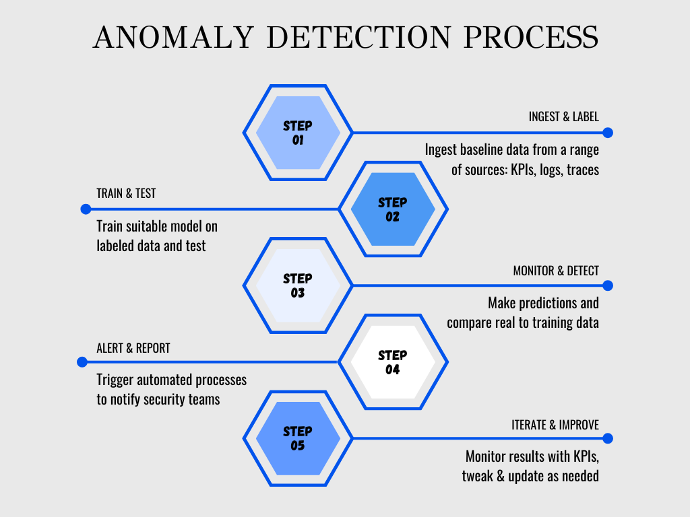
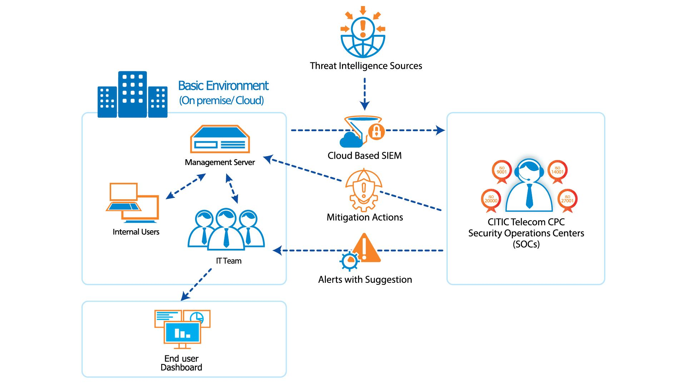
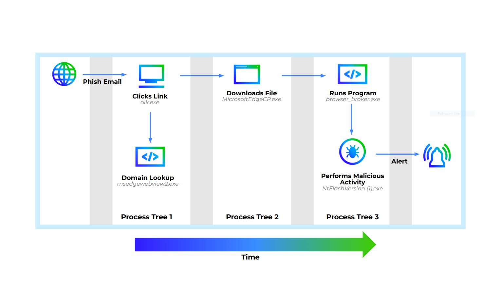

# Day 11 – Rare Process Detection

## Objective

Understand how SOC analysts detect **rare or uncommon processes** running in an environment using Microsoft Defender telemetry and KQL.

Rare process detection is a **behavioral anomaly detection technique** used to identify malware, attacker tools, and suspicious scripts that do not normally execute in an organization.

This detection method is widely used in **threat hunting, detection engineering, and SOC anomaly analysis**.

---

# 1. Concept Overview

Rare Process Detection identifies **processes that appear very infrequently across the environment**.

Instead of looking for a known malicious process name, this technique focuses on **unusual behavior patterns**.

Example idea:

If a process normally runs thousands of times per day:

```
chrome.exe
svchost.exe
explorer.exe
```

But a process appears only **1–3 times across the entire organization**, it may indicate:

* attacker tool execution
* malware dropper
* reconnaissance tool
* living-off-the-land binaries (LOLBins) used abnormally

This is considered **behavioral anomaly detection**.



---

# 2. Why This Exists in Enterprise Security

Signature-based detection cannot catch everything.

Attackers frequently use:

* custom malware
* renamed binaries
* legitimate tools used maliciously
* new attack frameworks

Example attacker tools:

```
mimikatz.exe
rclone.exe
adfind.exe
bloodhound.exe
```

Many of these tools:

* are not installed normally
* run only during attacks
* appear rarely in logs

Rare process detection helps identify **unknown or previously unseen attacker activity**.

---

# 3. Architecture Context

Rare process detection typically operates within the Microsoft security telemetry pipeline.

```
Endpoint Activity
↓
Microsoft Defender for Endpoint (EDR)
↓
DeviceProcessEvents telemetry
↓
Log Analytics Workspace
↓
Microsoft Sentinel Detection Query
↓
Analytics Rule
↓
Alert
↓
Incident
↓
SOC Investigation
↓
ServiceNow Ticket
```

Key systems involved:

* **Microsoft Defender for Endpoint (EDR)**
* **Log Analytics Workspace**
* **Microsoft Sentinel (SIEM)**

---

# 4. Core Components

### Process Execution

Every time a process starts on an endpoint:

```
ProcessStart Event
```

Telemetry captured includes:

* process name
* command line
* parent process
* user
* device name
* file hash
* timestamp

---

### Process Frequency Analysis

Rare detection relies on:

```
Process frequency
```

Example:

| Process | Execution Count |
|-------|------|
| chrome.exe | 50,000 |
| explorer.exe | 30,000 |
| powershell.exe | 3,500 |
| mimikatz.exe | 1 |

Rare processes stand out statistically.

---

# 5. Log Sources / Data Sources

Primary telemetry source:

### Microsoft Defender for Endpoint

Table:

```
DeviceProcessEvents
```

Important fields:

| Field | Description |
|-----|------|
| TimeGenerated | event timestamp |
| DeviceName | endpoint hostname |
| ProcessName | process name |
| ProcessCommandLine | full command |
| InitiatingProcessName | parent process |
| AccountName | user executing process |
| SHA256 | file hash |

This table provides **detailed process execution telemetry**.



---

# 6. Detection Logic

Rare detection typically follows this logic:

```
Collect process execution data
↓
Count process frequency
↓
Identify processes executed very few times
↓
Investigate suspicious rare processes
```

Example logic:

```
Process appears < 5 times across environment
```

Rare threshold can vary:

| Threshold | Usage |
|------|------|
| <10 | common baseline |
| <5 | strict detection |
| <3 | very rare anomaly |

---

# 7. Detection Example (KQL)

Basic rare process detection query.

```
DeviceProcessEvents
| summarize count() by ProcessName
| where count_ < 5
```

Explanation:

```
summarize count() by ProcessName
```

Counts number of executions per process.

```
where count_ < 5
```

Filters processes that appear less than five times.

These may represent:

* attacker tools
* malware
* unusual administrative utilities
* custom scripts

---

# 8. Improved Rare Process Detection Query

A more realistic enterprise query includes additional context.

```
DeviceProcessEvents
| summarize ProcessCount=count() by ProcessName, InitiatingProcessName
| where ProcessCount < 5
| project ProcessName, InitiatingProcessName, ProcessCount
| sort by ProcessCount asc
```

This helps analysts understand:

* which parent process launched it
* how rare it actually is

---

# 9. Advanced Rare Process Detection

SOC detection engineers often extend rare detection using:

### Time windows

```
rare process in last 24 hours
```

Example:

```
DeviceProcessEvents
| where TimeGenerated > ago(24h)
| summarize ProcessCount=count() by ProcessName
| where ProcessCount < 5
```

---

### Rare per device

Detect unusual processes **on a specific machine**.

```
DeviceProcessEvents
| summarize ProcessCount=count() by DeviceName, ProcessName
| where ProcessCount < 3
```

Useful for detecting:

* persistence
* attacker tools dropped on one host

---

### Rare command lines

Attackers often run:

```
powershell.exe -enc ...
```

Even if powershell is common, the **command line may be rare**.

```
DeviceProcessEvents
| summarize count() by ProcessCommandLine
| where count_ < 3
```

---

# 10. Investigation Workflow

When a rare process alert triggers, SOC analysts investigate using structured steps.

---

## Step 1 — Identify the Device

Check:

```
DeviceName
```

Questions:

* Which system executed the process?
* Is it a workstation or server?

---

## Step 2 — Identify the User

Check:

```
AccountName
```

Questions:

* Which user ran the process?
* Is it an admin account?

---

## Step 3 — Inspect Command Line

```
ProcessCommandLine
```

Look for:

* encoded PowerShell
* suspicious flags
* script downloads
* credential dumping commands

---

## Step 4 — Check Parent Process

```
InitiatingProcessName
```

Example suspicious chain:

```
winword.exe
↓
powershell.exe
↓
unknown.exe
```

Possible phishing payload.

---

## Step 5 — Check File Hash

Investigate:

```
SHA256
```

Check reputation using:

* VirusTotal
* Defender portal
* threat intelligence feeds

---

## Step 6 — Check Execution Timeline

Look at:

```
Device timeline
```

Questions:

* Did the process spawn other processes?
* Did it connect to the network?
* Did it create files?

---

# 11. Common Attack Scenarios

Rare process detection often reveals:

---

### Credential Dumping

Example:

```
mimikatz.exe
```

Used for:

* LSASS credential extraction

---

### Data Exfiltration Tools

Example:

```
rclone.exe
```

Used for:

* cloud data theft

---

### Reconnaissance Tools

Example:

```
adfind.exe
```

Used for:

* Active Directory enumeration

---

### Malware Execution

Example:

```
invoice_update.exe
```

Dropped through phishing.



---

# 12. False Positive Considerations

Rare processes are not always malicious.

Legitimate examples include:

* new software installation
* IT administrative tools
* internal scripts
* software updates
* custom enterprise applications

Example:

```
company_backup_tool.exe
```

May run rarely but be legitimate.

---

# 13. Detection Tuning Strategy

Detection engineers reduce noise using allowlists.

Example tuning methods:

### Exclude known applications

```
| where ProcessName !in ("backup.exe","inventorytool.exe")
```

---

### Exclude trusted paths

```
| where FolderPath !contains "Program Files"
```

---

### Exclude service accounts

```
| where AccountName != "backup-service"
```

---

# 14. SOC Analyst Responsibilities

## L1 SOC Analyst

Responsibilities:

* triage rare process alerts
* verify process legitimacy
* check command line
* check user activity
* escalate suspicious activity

---

## L2 SOC Analyst

Responsibilities:

* deeper investigation
* correlate endpoint telemetry
* verify malware indicators
* tune detection rules
* update allowlists

---

# 15. Real Enterprise Detection Strategy

Rare detection is usually combined with:

```
Rare Process
+
Suspicious Command Line
+
Network Connection
+
Privilege Escalation
```

This improves detection accuracy.

Example correlation:

```
rare process
+
powershell encoded command
+
external IP connection
```

This strongly indicates malicious activity.

---

# 16. Key Terminology

Important SOC terms related to this topic:

* Rare Event Detection
* Behavioral Anomaly Detection
* Process Telemetry
* Endpoint Detection and Response (EDR)
* Process Execution Monitoring
* Threat Hunting
* Detection Engineering
* Process Frequency Analysis
* Living-off-the-land binaries (LOLBins)

---

# 17. Interview Talking Points

Strong SOC interview explanation:

1. Rare process detection identifies processes that execute infrequently across the environment.
2. It is an anomaly detection technique used when signature-based detection fails.
3. SOC teams use Microsoft Defender telemetry like `DeviceProcessEvents` to analyze process frequency.
4. Rare events are investigated by analyzing device, user, command line, parent process, and file hash.
5. Detection tuning is required because rare processes may include legitimate administrative tools.

---

# 18. GitHub Documentation Summary

Rare Process Detection is an anomaly-based detection technique used in enterprise SOC environments to identify suspicious processes that execute infrequently across the environment.

Using Microsoft Defender for Endpoint telemetry (`DeviceProcessEvents`) and KQL queries in Microsoft Sentinel, security analysts can detect rare processes that may indicate attacker tools, malware execution, or unauthorized administrative activity.

SOC analysts investigate rare process alerts by examining the device, user, command line, parent process, and file hash, while detection engineers tune rules to reduce false positives by excluding known legitimate applications.

This technique is widely used in **threat hunting, detection engineering, and advanced SOC monitoring**.

---