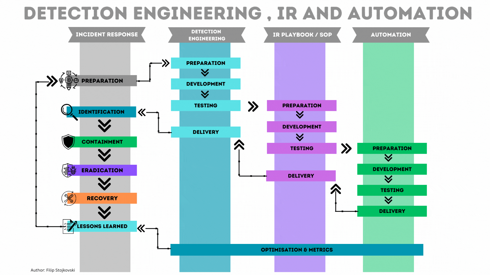
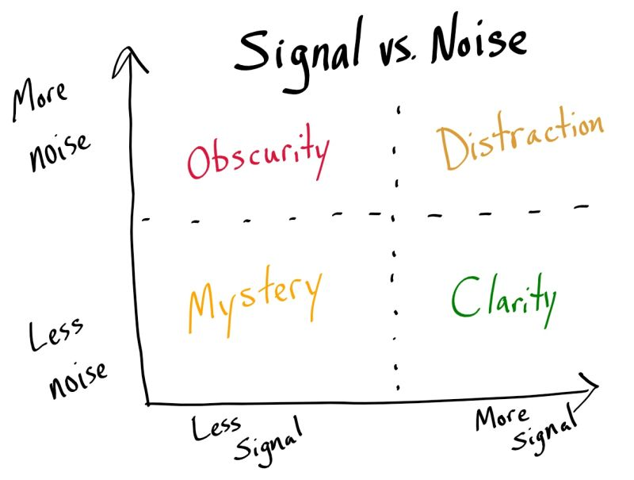

# Day 12 – Detection Tuning (Enterprise SOC Deep Dive)

## Objective

Master **detection tuning as a core SOC engineering skill** — the ability to transform noisy detections into **high-fidelity, production-ready security analytics** used in real enterprise environments.

This is where you move from:

```
“writing queries”
→
“engineering detections”
```

---

# 1. Concept Overview (Real SOC View)

Detection tuning is the **continuous process of refining detection logic** to:

* reduce false positives (noise)
* maintain detection coverage
* improve alert fidelity
* align with real enterprise behavior

### Core Reality

A detection rule is **never finished**.

```id="pipeline1"
Detection Idea
↓
Initial Query (Noisy)
↓
Deployment
↓
Alert Feedback
↓
Tuning Iterations
↓
Stable Detection (High Signal)
```



---

# 2. Why Detection Tuning is CRITICAL

### Without Tuning

```
1000 alerts/day
→ 900 false positives
→ SOC fatigue
→ missed real attack
```

### With Proper Tuning

```
100 alerts/day
→ 80% high confidence
→ faster triage
→ real threats detected
```



---

### Enterprise Impact

| Area               | Without Tuning | With Tuning |
| ------------------ | -------------- | ----------- |
| Analyst Efficiency | Low            | High        |
| SLA Compliance     | Broken         | Maintained  |
| Detection Accuracy | Poor           | Strong      |
| SOC Burnout        | High           | Reduced     |

---

# 3. Architecture Context (Where Tuning Lives)

Detection tuning happens at **multiple layers**, not just Sentinel.

```
Telemetry Source Layer
↓
(Defender / Entra / Azure logs)
↓
Data Layer
(Log Analytics Workspace)
↓
Detection Layer ⚙️
(Sentinel Analytics Rules)
↓
Alert Layer
↓
Incident Layer
↓
SOC Investigation
```

---

### Key Insight

Tuning is applied:

* in KQL queries
* in analytics rule configuration
* in incident grouping logic
* in SOAR automation

---

# 4. Types of Detection Tuning (VERY IMPORTANT)

## 1. Query-Level Tuning

Modify KQL logic:

* filters
* joins
* exclusions
* conditions

---

## 2. Rule-Level Tuning

Inside Sentinel:

* threshold count
* frequency
* lookback duration
* grouping settings

---

## 3. Entity-Level Tuning

Exclude or adjust:

* users
* devices
* IPs
* applications

---

## 4. Behavior-Based Tuning

Move from:

```
static detection → behavioral detection
```

Example:

* Instead of “PowerShell executed”
* Detect “unusual PowerShell execution pattern”

---

## 5. Environment-Aware Tuning

Each enterprise has:

* different tools
* different admin patterns
* different baselines

👉 No detection is universal

---

# 5. Log Sources & Their Tuning Challenges

| Data Source         | Problem             | Tuning Approach          |
| ------------------- | ------------------- | ------------------------ |
| SigninLogs          | noisy failed logins | exclude trusted IPs      |
| DeviceProcessEvents | admin scripts       | exclude service accounts |
| DeviceNetworkEvents | internal traffic    | filter internal ranges   |
| AzureActivity       | admin operations    | allow known roles        |
| SecurityEvent       | system noise        | filter system accounts   |

---

# 6. Detection Engineering Lifecycle (REAL WORLD)

```
Use Case Defined
↓
Write KQL Query
↓
Deploy Analytics Rule
↓
Alert Generation
↓
SOC Feedback (L1)
↓
Tuning by L2
↓
Re-deployment
↓
Continuous Improvement
```

---

# 7. Deep Dive: Core Tuning Techniques

---

## Technique 1: Service Account Exclusion

### Why?

Service accounts:

* run scheduled jobs
* execute scripts
* generate repetitive logs

---

### Example

```kql
| where AccountName !contains "svc"
```

---

### Advanced Version

```kql
let ServiceAccounts = dynamic(["svc_backup","svc_sync","svc_app"]);
DeviceProcessEvents
| where AccountName !in (ServiceAccounts)
```

---

## Technique 2: Trusted IP Exclusion

### Why?

Internal or known IPs generate:

* scans
* automation traffic
* monitoring activity

---

### Example

```kql
| where IPAddress !startswith "10."
| where IPAddress !startswith "192.168."
```

---

### Enterprise Version

```kql
let TrustedIPs = dynamic(["10.0.0.1","172.16.0.5"]);
SigninLogs
| where IPAddress !in (TrustedIPs)
```

---

## Technique 3: Threshold Optimization

### Problem

Low threshold = noisy
High threshold = missed attack

---

### Example Evolution

```kql
// Initial
FailedAttempts > 5

// Tuned
FailedAttempts > 15
```

---

### Advanced: Dynamic Threshold

```kql
| summarize avgAttempts = avg(FailedAttempts)
| where FailedAttempts > avgAttempts * 2
```

---

## Technique 4: Time Window Tuning

| Window | Behavior  |
| ------ | --------- |
| 5 min  | sensitive |
| 15 min | balanced  |
| 1 hour | stable    |

---

### Example

```kql
bin(TimeGenerated, 15m)
```

---

## Technique 5: Allowlisting (VERY POWERFUL)

Instead of excluding patterns, define allowed entities:

```kql
| where ProcessName !in ("trusted_app.exe","backup.exe")
```

---

## Technique 6: Contextual Filtering

Add conditions:

```kql
| where Country != "India"
| where DeviceType != "Server"
```

---

## Technique 7: Multi-Condition Correlation

Reduce noise by combining signals:

```kql
SigninLogs
| where ResultType != 0
| summarize FailedAttempts=count() by IPAddress, bin(TimeGenerated,5m)
| where FailedAttempts > 10
| join (
    SigninLogs
    | where ResultType == 0
) on IPAddress
```

👉 Detects **failures followed by success** (more meaningful)

---

# 8. Investigation-Driven Tuning (MOST IMPORTANT SKILL)

Tuning comes from **real alerts**, not theory.

---

## SOC Feedback Loop

```
Alert Triggered
↓
L1 investigates
↓
Marks False Positive
↓
Feedback to L2
↓
Detection Updated
```

---

## Questions L2 Must Ask

* Why did this trigger?
* Is this normal behavior?
* Can we filter it safely?
* Will filtering hide attacks?

---

# 9. Advanced Enterprise Tuning Patterns

---

## Pattern 1: Baseline Deviation Detection

Instead of static thresholds:

```kql
Detect abnormal behavior per user/device
```

---

## Pattern 2: Peer Group Analysis

Compare user with similar roles:

* admin vs normal user
* server vs workstation

---

## Pattern 3: Rare Event Filtering

```kql
| summarize count() by ProcessName
| where count_ < 5
```

Then tune:

* exclude known rare but safe processes

---

## Pattern 4: Suppression Logic

In Sentinel:

* suppress repeated alerts for X duration

---

# 10. Real Attack Scenario (End-to-End)

## Scenario: Brute Force with Noise

### Raw Detection

Triggers on:

* attackers
* vulnerability scanners
* internal scripts

---

### After Tuning

```kql
SigninLogs
| where ResultType != 0
| where IPAddress !startswith "10."
| where UserPrincipalName !contains "svc"
| summarize FailedAttempts=count() by IPAddress, bin(TimeGenerated,10m)
| where FailedAttempts > 15
```

---

### Result

* 80% noise removed
* attacker behavior still detected

---

# 11. False Positive Engineering Mindset

False positives are:

❌ Not bad
✅ Learning signals

---

### Common Sources

* IT automation
* patch management
* monitoring tools
* backup systems
* admin activity

---

# 12. Detection Tuning Strategy (Production Grade)

## Step-by-Step

### Step 1: Deploy detection (initial)

---

### Step 2: Collect alerts (1–3 days)

---

### Step 3: Analyze patterns

* same user?
* same IP?
* same process?

---

### Step 4: Add exclusions

---

### Step 5: Adjust thresholds

---

### Step 6: Validate again

---

### Step 7: Repeat (continuous)

---

# 13. SOC Analyst Responsibilities

---

## L1 Analyst

* triage alerts
* identify false positives
* document patterns

---

## L2 Analyst

* tune detection queries
* optimize thresholds
* correlate logs
* improve detection logic

---

## Detection Engineer (Advanced Role)

* design detection frameworks
* implement behavioral analytics
* build reusable logic

---

# 14. Key Terminology

* Detection Tuning
* Alert Fidelity
* False Positive Reduction
* Threshold Engineering
* Behavioral Detection
* Allowlisting
* Baseline Deviation
* Detection Lifecycle

---

# 15. Interview Talking Points (Strong Answers)

1. Detection tuning is essential for reducing alert fatigue and improving SOC efficiency.

2. It involves excluding known benign activity such as service accounts and trusted IPs.

3. Tuning is an iterative process based on real alert feedback from SOC analysts.

4. Proper tuning balances detection sensitivity and accuracy.

5. L2 analysts play a key role in refining detection logic in Microsoft Sentinel using KQL.

---