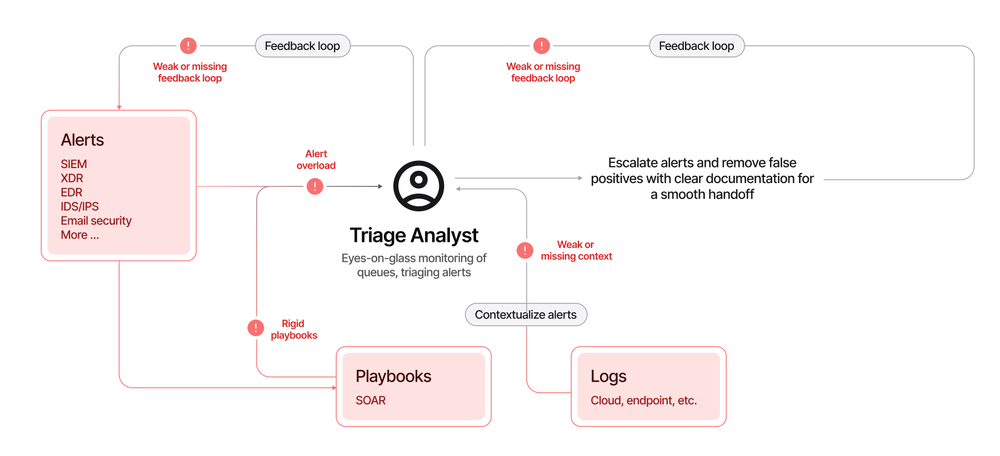
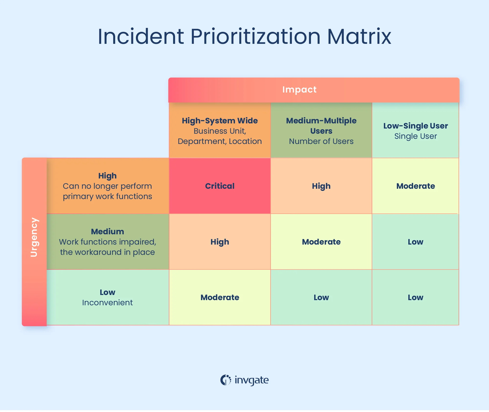
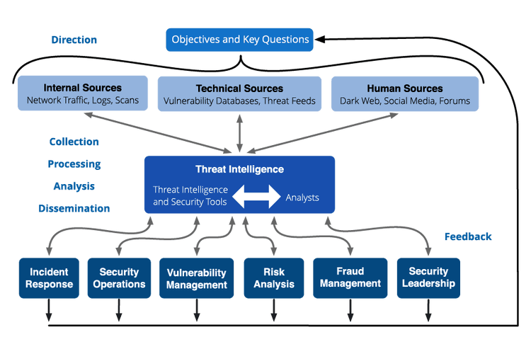
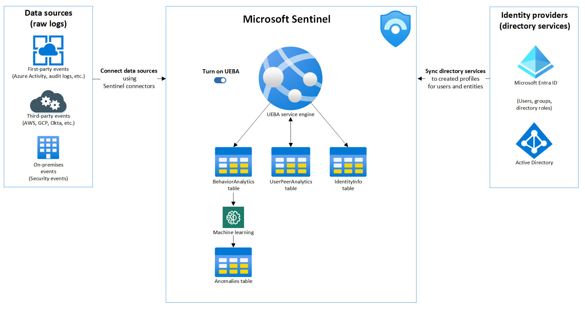

# Day 15 – Alert Triage Methodology

## Objective
Understand how SOC analysts evaluate alerts, prioritize incidents, and decide whether to escalate or close alerts in an enterprise Microsoft SOC environment.

---

## 1. Concept Overview

Alert triage is the **first decision-making stage** in SOC operations.

It determines:

• Is this alert important?  
• Is it real or noise?  
• Does it require investigation or escalation?  

This is where **L1 SOC analysts operate most of the time**.

### Core Workflow
Alert
↓
Initial Triage
↓
Log Correlation
↓
Threat Intelligence Check
↓
False Positive / True Positive
↓
Escalation or Closure

---

## 2. Why This Exists in Enterprise Security

Enterprise environments generate **thousands of alerts daily**.

Without triage:

• SOC gets overwhelmed  
• Real attacks get missed  
• Analysts waste time on noise  

### Purpose of Triage

• Reduce alert fatigue  
• Prioritize high-risk threats  
• Filter false positives  
• Enable fast incident response  

---

## 3. Architecture Context

Alert triage sits **after detection and before investigation escalation**.
Endpoint Activity
↓
Microsoft Defender (EDR/XDR)
↓
Log Analytics Workspace
↓
Microsoft Sentinel Analytics Rule
↓
Alert
↓
🔥 ALERT TRIAGE (YOU ARE HERE)
↓
Incident Creation / Investigation
↓
ServiceNow Ticket
↓
Incident Response

This is a **critical control point** in the SOC pipeline :contentReference[oaicite:0]{index=0}

---

## 4. Core Components of Alert Triage

### 1. Alert Metadata

Includes:

• Alert name  
• Severity (Low / Medium / High / Critical)  
• Timestamp  
• Affected entity (User, Host, IP)  
• Detection rule  

---

### 2. Entities

Key investigation pivot points:

• User (UPN)  
• Device (Hostname)  
• IP Address  
• File Hash  
• Process  

---

### 3. Alert Evidence

• Process execution  
• Login activity  
• Network connections  
• File activity  

---

### 4. Alert Context

• Previous alerts on same entity  
• Timeline of activity  
• Related incidents  

---

## 5. Log Sources / Data Sources

SOC triage relies on **multi-source telemetry correlation**:

### Identity Logs
• `SigninLogs`  
• `AuditLogs`

### Endpoint Logs
• `DeviceProcessEvents`  
• `DeviceNetworkEvents`  
• `DeviceFileEvents`

### Cloud Logs
• `AzureActivity`

### Email Logs
• `OfficeActivity`

---

## 6. Alert Prioritization Logic

Not all alerts are equal.

### Severity-Based Prioritization

| Severity | Meaning |
|----------|--------|
| Critical | Active compromise likely |
| High     | Strong suspicious activity |
| Medium   | Needs validation |
| Low      | Informational / noise |

---

### Risk-Based Prioritization

Analysts evaluate:

• Privileged account involved?  
• Critical server affected?  
• Known malicious IP?  
• Lateral movement signs?  

---

### Example Thought Process
Low severity + normal user → likely ignore
High severity + admin account → investigate immediately
Multiple alerts on same host → escalate priority

---

## 7. Step-by-Step Triage Workflow

### Step 1 – Understand the Alert

Ask:

• What triggered this alert?  
• Which detection rule fired?  

---

### Step 2 – Validate Entities

Check:

• User involved  
• Device involved  
• IP address  

---

### Step 3 – Check Historical Context
Is this the first time?
OR
Recurring behavior?

---

### Step 4 – Log Correlation

Correlate across logs:

• Login activity  
• Process execution  
• Network activity  

---

### Step 5 – Threat Intelligence Check

Validate indicators:

• IP reputation  
• File hash  
• Domain  

---

### Step 6 – Decide
False Positive → Close
Suspicious → Investigate further
Malicious → Escalate to L2

---

## 8. Investigation Start Criteria

When should you investigate deeper?

### Start Investigation If:

• High/critical severity  
• Multiple alerts linked together  
• Privileged account involved  
• Suspicious process execution  
• Known malicious indicators  

---

### Do NOT Investigate If:

• Known false positive pattern  
• Trusted internal activity  
• Previously whitelisted behavior  

---

## 9. Detection Logic Behind Alerts

Alerts originate from detection rules.

Example:

### Brute Force Detection
SigninLogs
| where ResultType != 0
| summarize FailedAttempts=count() by IPAddress, bin(TimeGenerated,5m)
| where FailedAttempts > 10

Triage checks:

• Is IP malicious?  
• Was login successful later?  
• Is user compromised?  

---

## 10. Investigation Workflow Example

### Scenario: Suspicious PowerShell Alert
Alert: PowerShell Execution Detected

### Triage Steps

1. Check process:
   • Command line arguments  

2. Check parent process:
   • Was it spawned by Word/Excel?  

3. Check user:
   • Normal behavior?  

4. Check timeline:
   • Any login anomalies?  

5. Check threat intel:
   • Known malicious script?  

---

## 11. Common Attack Scenarios

Alert triage is critical in:

### 1. Brute Force Attack
• Multiple failed logins  
• IP-based detection  

---

### 2. Phishing → Credential Theft
• Suspicious login  
• Impossible travel  

---

### 3. Malware Execution
• PowerShell / encoded commands  

---

### 4. Lateral Movement
• PsExec / WMI activity  

---

## 12. SOC Analyst Responsibilities

### L1 Analyst

• Perform initial triage  
• Validate alerts  
• Close false positives  
• Escalate real threats  

---

### L2 Analyst

• Deep investigation  
• Correlation across sources  
• Root cause analysis  
• Detection tuning  

---

## 13. False Positive Considerations

Common false positives:

• IT admin scripts  
• Scheduled tasks  
• Vulnerability scanners  
• Backup systems  
• Internal automation  

---

## 14. Detection Tuning Strategy

Reduce noise by:

• Excluding trusted IPs  
• Whitelisting service accounts  
• Adjusting thresholds  
• Filtering known benign processes  

---

### Example

Instead of:
FailedAttempts > 10

Use:
FailedAttempts > 20 AND IP not in trusted list

---

## 15. Key Terminology

• Alert Triage  
• False Positive  
• True Positive  
• Severity  
• Correlation  
• Entity Mapping  
• Threat Intelligence  
• Investigation Workflow  
• SOC Pipeline  

---

## 16. Interview Talking Points

1. Alert triage is the process of evaluating alerts to determine if they are real threats or false positives.

2. It involves analyzing alert metadata, correlating logs, and validating indicators using threat intelligence.

3. Analysts prioritize alerts based on severity, impacted assets, and risk context.

4. L1 analysts handle triage and escalation, while L2 analysts perform deep investigations.

5. Effective triage reduces alert fatigue and ensures faster incident response.

---

## 17. GitHub Documentation Section

# Day 15 – Alert Triage Methodology

## Objective
Learn how SOC analysts evaluate alerts and determine whether to escalate or close incidents.

## Architecture Context
Alerts generated in Microsoft Sentinel are triaged before investigation and incident response.

## Core Components
Alert metadata, entities, telemetry logs, threat intelligence.

## Log Sources
SigninLogs, DeviceProcessEvents, AzureActivity, OfficeActivity.

## Detection Logic
Alerts are generated based on detection rules using thresholds and behavioral patterns.

## Investigation Workflow
Initial triage → log correlation → threat intel check → decision.

## False Positives
Admin activity, automation scripts, trusted IPs.

## Detection Tuning
Threshold adjustment, whitelisting, filtering noise.

## SOC Responsibilities
L1 handles triage, L2 handles deep investigation.

## Key Takeaways
Alert triage is critical for reducing noise, prioritizing threats, and enabling efficient SOC operations.

---

## Final Insight

Alert triage is where **SOC intelligence is applied**.

Detection gives you signals.  
Triage gives you decisions.

A strong SOC analyst is not the one who sees alerts —  
but the one who **understands which alerts matter.**