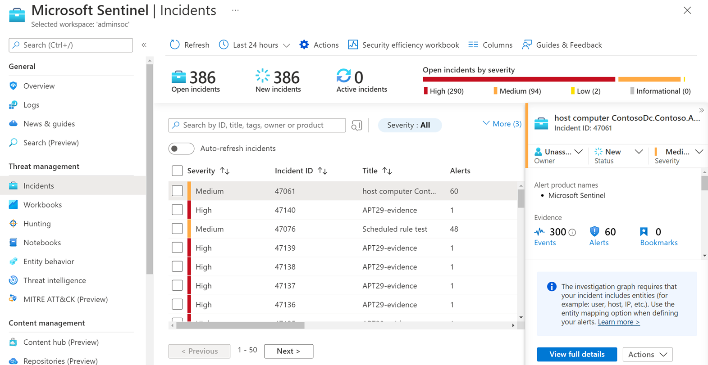
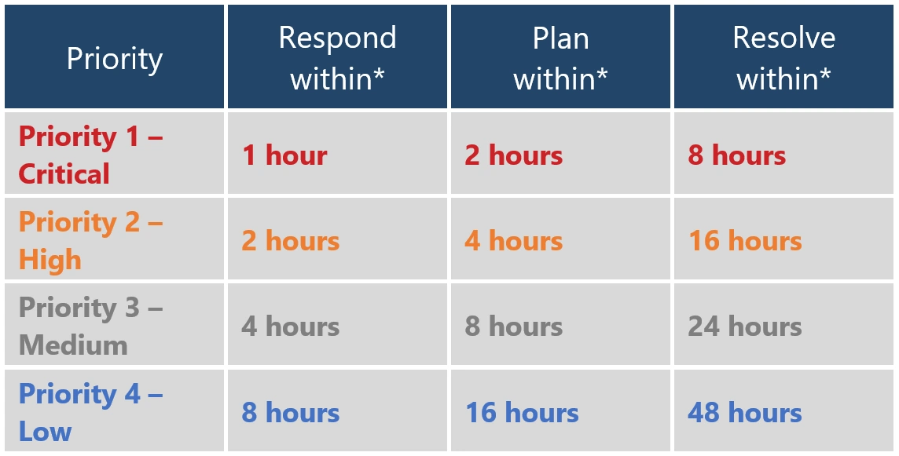
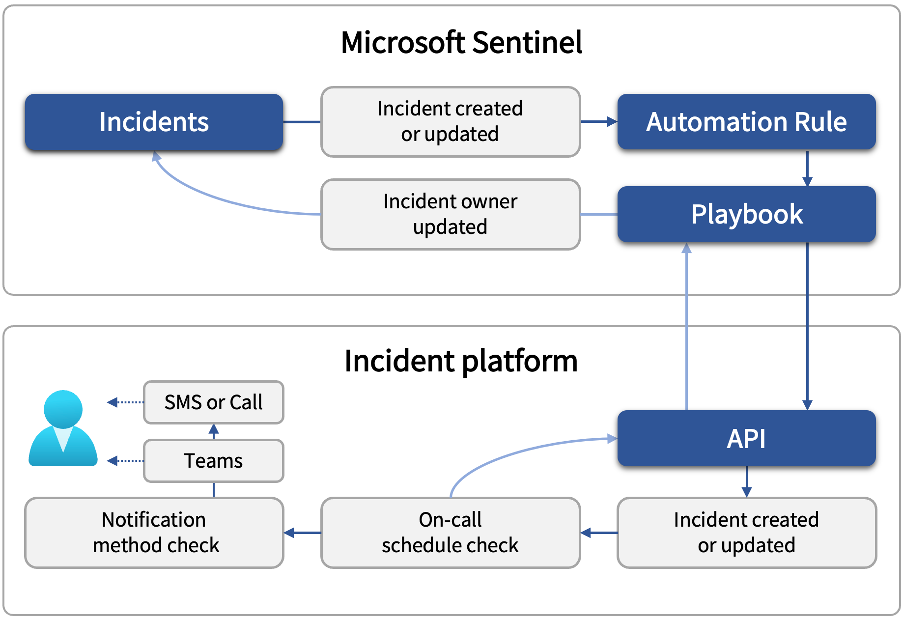
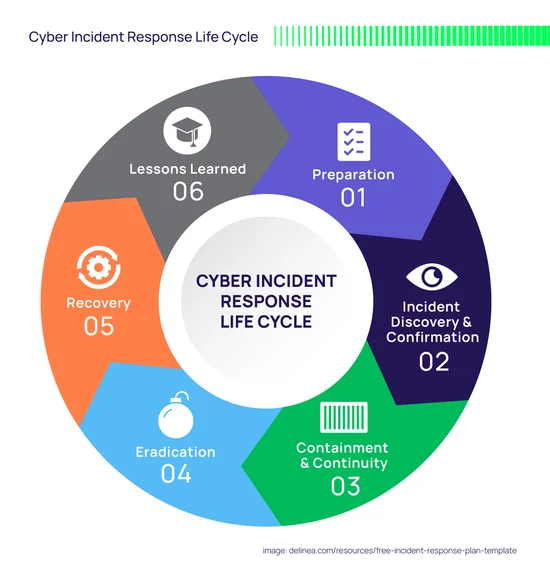

# Day 16 – Incident Queue & SLA Management

## Objective

Understand how incidents are **managed, prioritized, tracked, and resolved** inside an enterprise SOC using queue management, severity classification, SLA enforcement, and lifecycle handling.



---

# 1. Concept Overview

Incident Queue Management is the **operational backbone of a SOC**.

It ensures:

* incidents are **properly prioritized**
* analysts work on the **right alerts at the right time**
* response is aligned with **business risk (SLA)**
* nothing is missed or delayed

This is where SOC shifts from **detection → operations**.

---

# 2. Why This Exists in Enterprise Security

In real environments:

* thousands of alerts are generated daily
* multiple analysts work in shifts
* incidents vary in criticality

Without queue & SLA management:

* critical breaches get delayed
* analysts duplicate work
* incidents remain uninvestigated
* business risk increases

This system ensures:

```
Right Incident
↓
Right Priority
↓
Right Analyst
↓
Right Time
```

---

# 3. Architecture Context

Incident queue sits after detection and before resolution:

```
Endpoint Activity
↓
Microsoft Defender Detection
↓
Log Analytics Workspace
↓
Microsoft Sentinel Rule
↓
Alert
↓
Incident Creation
↓
🔥 Incident Queue (THIS LAYER)
↓
SOC Analyst Investigation
↓
ServiceNow Ticket / Response
↓
Closure
```

---

# 4. Core Components

## 4.1 Incident Queue

Central dashboard where all incidents are listed.

Fields include:

* Incident ID
* Severity
* Status
* Owner
* Created Time
* SLA Timer

---

## 4.2 Severity Assignment

Defines **business impact and urgency**.

| Severity | Meaning                       |
| -------- | ----------------------------- |
| Critical | Active breach / high impact   |
| High     | Confirmed suspicious activity |
| Medium   | Potential threat              |
| Low      | Informational / low risk      |

---

## 4.3 Ownership

Defines **who is responsible**.

* Unassigned → waiting for analyst
* Assigned → analyst working
* Reassigned → escalated or shifted

---

## 4.4 Status Lifecycle

Tracks progress of investigation.

```
New
↓
In Progress
↓
On Hold (optional)
↓
Closed
```

---

## 4.5 SLA (Service Level Agreement)

Defines **maximum allowed response time**.

| Severity | Response Time |
| -------- | ------------- |
| Critical | 15 minutes    |
| High     | 30 minutes    |
| Medium   | 2 hours       |
| Low      | 24 hours      |

---

# 5. Incident Filtering

SOC analysts cannot manually scan everything.

Filtering is used to prioritize:

## Common Filters

* Severity = High / Critical
* Status = New
* Assigned to = Me
* Time = Last 24 hours
* Specific attack type (e.g., brute force)

## Example Workflow

```
Queue Open
↓
Filter: Severity = Critical
↓
Sort by Time Created
↓
Pick Oldest First
```

---

# 6. Severity Assignment Logic

Severity is assigned by:

## 6.1 Detection Rule Logic

Example:

* 100 failed logins → High
* Malware execution → Critical

---

## 6.2 Entity Sensitivity

* Domain Admin → higher severity
* VIP user → higher severity
* Critical server → higher severity

---

## 6.3 Context-Based Adjustment

SOC analysts may adjust severity:

Example:

* Known scanner IP → downgrade
* Confirmed compromise → upgrade

---

# 7. Status Lifecycle Deep Dive

## 7.1 New

* Incident just created
* No analyst assigned

---

## 7.2 In Progress

* Analyst investigating
* Ownership assigned

---

## 7.3 On Hold

Used when:

* waiting for logs
* waiting for user confirmation
* dependency on another team

---

## 7.4 Closed

Final state:

* True Positive (incident handled)
* False Positive (benign activity)

---

# 8. SLA Management

## 8.1 What SLA Measures

* Time to first response
* Time to resolution



---

## 8.2 SLA Timer Behavior

Starts when:

```
Incident Created → SLA Timer Starts
```

Stops when:

```
Analyst Responds OR Incident Closed
```

---

## 8.3 SLA Violation

Occurs when:

* response exceeds defined time

Example:

* Critical incident not touched in 15 minutes → SLA breach

---

## 8.4 Why SLA Matters

* ensures fast response to threats
* defines SOC performance metrics
* used in audits & compliance

---

# 9. Detection → Queue → Response Flow

```
Detection Rule Triggered
↓
Alert Generated
↓
Incident Created
↓
Severity Assigned
↓
Added to Queue
↓
Analyst Picks Incident
↓
Status → In Progress
↓
Investigation
↓
Closure
```



---

# 10. Investigation Workflow from Queue

## Step-by-Step

### Step 1: Pick Incident

* Based on severity & SLA

### Step 2: Assign Ownership

* Avoid duplication

### Step 3: Change Status → In Progress

### Step 4: Review Incident Details

* entities (user, IP, host)
* alert timeline

### Step 5: Correlate Logs

```
SigninLogs
DeviceEvents
SecurityEvent
```

### Step 6: Decide

* True Positive → escalate/respond
* False Positive → close

---

# 11. Common Attack Scenarios

## 11.1 Critical Incident

* Ransomware detected
* Immediate response required
* SLA: 15 minutes

---

## 11.2 High Severity

* Suspicious PowerShell execution
* Potential compromise

---

## 11.3 Medium Severity

* Multiple failed logins
* possible brute force

---

## 11.4 Low Severity

* rare but benign process
* informational alerts

---

# 12. SOC Analyst Responsibilities

## L1 Analyst

* monitor queue continuously
* filter and prioritize incidents
* assign ownership
* perform initial investigation
* escalate if needed
* ensure SLA compliance

---

## L2 Analyst

* handle escalated incidents
* perform deep investigation
* correlate across data sources
* adjust severity if required
* provide feedback for tuning

---

# 13. False Positive Considerations

Examples:

* vulnerability scanners → high login attempts
* admin scripts → PowerShell alerts
* security tools → flagged as suspicious

---

# 14. Tuning Strategy

## Reduce Noise

* exclude known IPs
* exclude service accounts
* whitelist internal tools

---

## Improve Severity Accuracy

* adjust thresholds
* incorporate asset criticality
* use enrichment (threat intel)



---

# 15. Key Terminology

* Incident Queue
* SLA (Service Level Agreement)
* Severity
* Ownership
* Status Lifecycle
* Queue Filtering
* Incident Prioritization
* SLA Breach
* SOC Operations

---

# 16. Interview Talking Points

1. Incident queue management ensures **efficient prioritization and handling of alerts in SOC operations**.

2. SLA defines **how quickly incidents must be responded to based on severity**.

3. Severity is determined using **detection logic, asset criticality, and contextual risk**.

4. Status lifecycle tracks investigation progress from **New → In Progress → Closed**.

5. SOC analysts use filtering and prioritization to ensure **critical incidents are handled first**.

---

# 17. GitHub Documentation Section

## Day 16 – Incident Queue & SLA Management

### Objective

Understand how incidents are prioritized, assigned, and managed using SLA-driven workflows in enterprise SOC environments.

### Architecture Context

Alert → Incident → Queue → Analyst → Investigation → Closure

### Core Components

* Incident Queue
* Severity Levels
* Ownership
* Status Lifecycle
* SLA

### Log Sources

* SigninLogs
* SecurityEvent
* DeviceEvents
* AzureActivity

### Detection Logic

Incidents are prioritized based on severity derived from detection rules and contextual risk.

### Investigation Workflow

1. Filter queue
2. Assign incident
3. Change status
4. Investigate logs
5. Decide outcome

### False Positives

Scanner activity, admin scripts, and internal tools.

### Detection Tuning

Whitelisting, threshold tuning, contextual enrichment.

### Real Attack Scenario

Critical malware alert requiring response within SLA window.

### SOC Responsibilities

L1 handles triage and SLA compliance, L2 handles deep investigation and tuning.

### Key Takeaways

Incident queue management is essential for **efficient SOC operations, prioritization, and timely response to threats**.

---

**Project Context Reference:** 
**Learning Plan Alignment:** 
**SOC Training Framework Applied:** 
