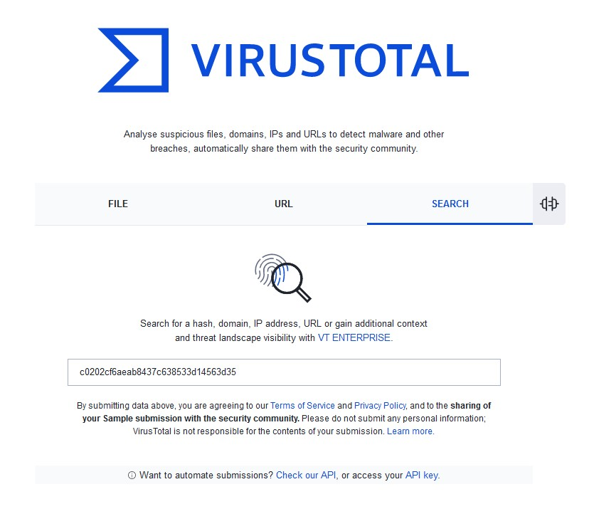
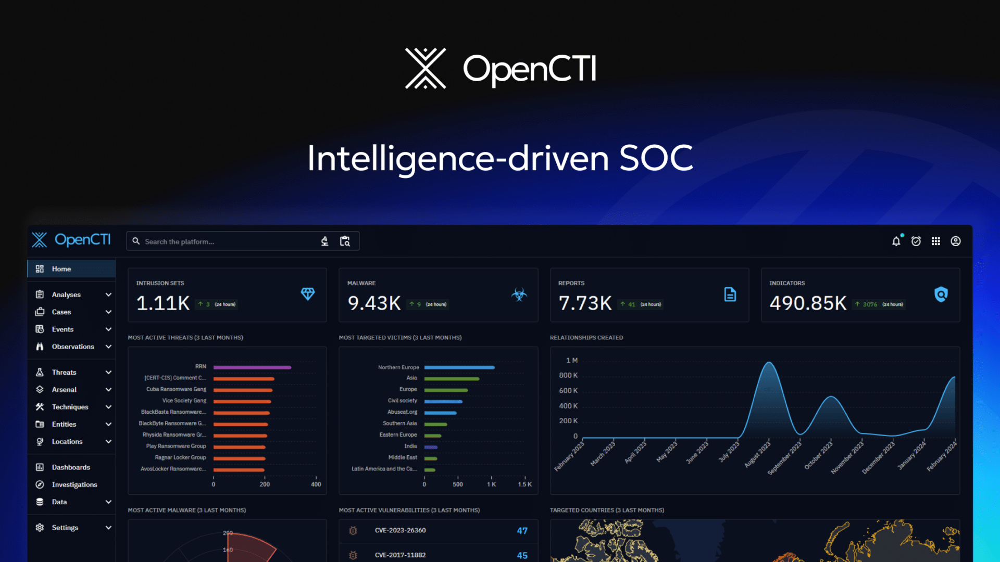
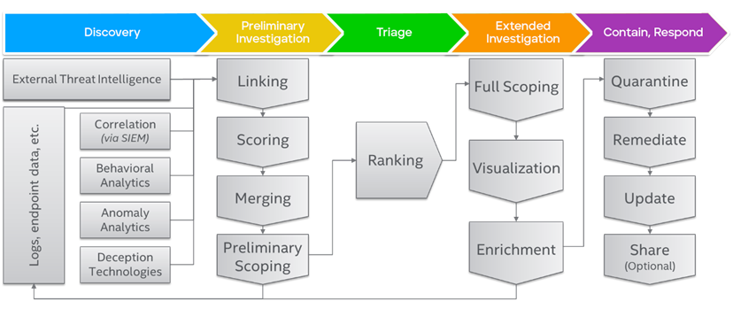
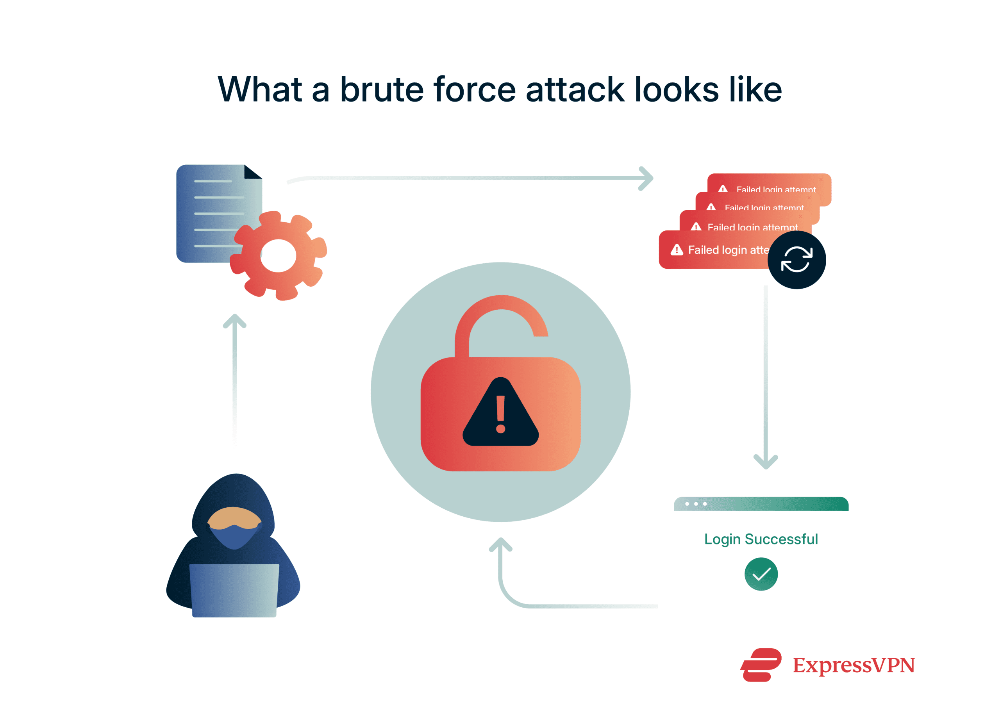
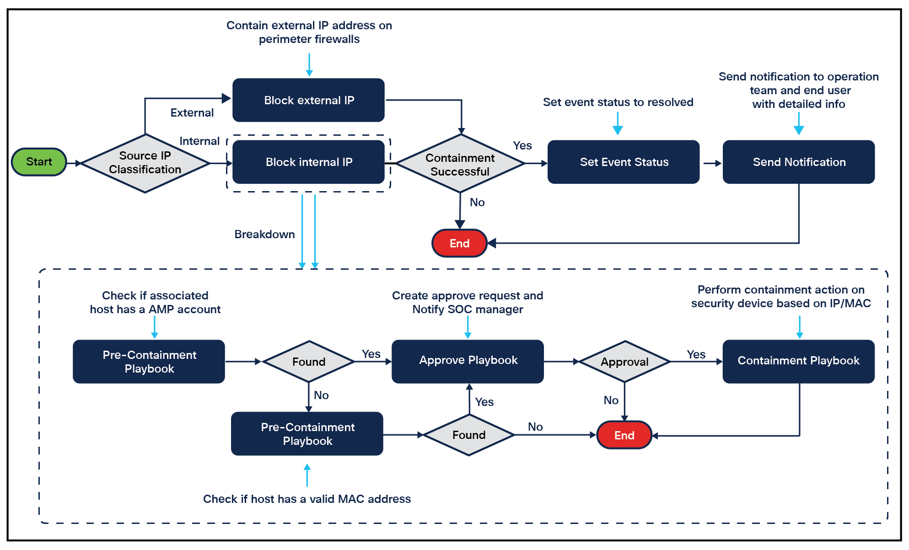

# Day 23 – Threat Intelligence Enrichment

## Objective

Understand how SOC analysts enrich indicators (IP, domain, file hash) using threat intelligence to transform raw alerts into actionable security decisions.

---

# 1. Concept Overview

Threat Intelligence Enrichment is the process of **adding external and internal context to raw indicators** observed during detection or investigation.

Indicators include:

* IP address
* Domain name
* File hash (MD5, SHA1, SHA256)
* URL
* Email sender

Raw indicators alone are meaningless until enriched with:

* reputation
* history
* behavior
* known attack associations

---

## Core Enrichment Flow

```
Indicator
↓
Threat Intelligence Lookup
↓
Context Enrichment
↓
Risk Evaluation
```

This exact workflow is a **core SOC investigation step** 

---

# 2. Why This Exists in Enterprise Security

SOC environments generate **massive volumes of alerts**.

Problem:

* Alerts contain raw indicators
* No immediate clarity if malicious or benign

Threat intelligence enrichment solves:

* reduces investigation time
* improves accuracy of decisions
* enables automated response (SOAR)
* prioritizes high-risk threats

Without enrichment:

* SOC becomes reactive and slow
* analysts rely on guesswork

With enrichment:

* decisions become **evidence-based**

---

# 3. Architecture Context (Microsoft SOC)

Threat intelligence enrichment sits inside the **investigation phase** of the SOC pipeline:

```
Endpoint Activity
↓
Microsoft Defender Detection
↓
Log Analytics Workspace
↓
Microsoft Sentinel Rule
↓
Alert / Incident
↓
Threat Intelligence Enrichment
↓
SOC Investigation Decision
↓
ServiceNow Ticket / Response
```

This aligns with the enterprise SOC pipeline described in your project 

---

# 4. Core Components of Threat Intelligence Enrichment

## 4.1 Indicator Types

### IP Address

* source of login or network traffic
* used in brute force, C2 communication

### Domain / URL

* phishing infrastructure
* malware hosting

### File Hash

* identifies exact malware sample
* used in endpoint detection

---

## 4.2 Threat Intelligence Sources

### External Sources

* Microsoft Threat Intelligence
* VirusTotal
* AbuseIPDB
* Open Threat Feeds




### Internal Sources

* past incidents
* SIEM historical logs
* previously blocked indicators

---

## 4.3 Context Enrichment Data

When enriching, analysts look for:

* Reputation score
* First seen / last seen
* Geographic location
* ASN / hosting provider
* Malware family association
* Known campaigns (APT, ransomware)
* Behavioral classification

---

# 5. Log Sources / Data Sources

## Microsoft Relevant Tables

### Identity (Entra ID)

* `SigninLogs`
* `AuditLogs`

### Endpoint (Defender)

* `DeviceNetworkEvents`
* `DeviceFileEvents`
* `DeviceProcessEvents`

### Cloud

* `AzureActivity`

### Threat Intelligence Table

* `ThreatIntelligenceIndicator` (Sentinel)

---

# 6. Detection Logic

Threat intelligence enrichment is used in **two major ways**:

---

## 6.1 Inline Detection (Real-Time Matching)

```
DeviceNetworkEvents
| where RemoteIP in (ThreatIntelligenceIndicator)
```

Detection Idea:

* match observed indicators with known malicious ones

---

## 6.2 Post-Alert Enrichment

After alert triggers:

* analyst manually checks indicator reputation

---

## 6.3 Correlation-Based Detection

```
SigninLogs
| where IPAddress in (malicious IP list)
| where ResultType == 0
```

Detects:

* successful login from known malicious IP

---

# 7. Investigation Workflow (SOC Thinking)



## Step-by-Step Analyst Approach

### Step 1: Identify Indicator

* extract IP / domain / hash from alert

---

### Step 2: Perform Threat Intelligence Lookup

Ask:

* Is this indicator known malicious?
* Is it part of a campaign?

---

### Step 3: Enrich Context

Check:

* geolocation
* ASN (cloud provider or residential)
* historical usage
* frequency in logs

---

### Step 4: Correlate with Internal Logs

```
Have we seen this IP before?
Did it access multiple users?
Is it associated with suspicious processes?
```

---

### Step 5: Risk Evaluation

Decision categories:

* **Malicious → escalate**
* **Suspicious → monitor**
* **Benign → close**

---

### Step 6: Take Action

* block IP/domain
* isolate endpoint
* disable account
* create incident ticket

---

# 8. Common Attack Scenarios

## 8.1 Brute Force Attack

```
Multiple failed logins
↓
Single IP
↓
IP enrichment shows botnet activity
```



---

## 8.2 Phishing Attack

```
User clicks link
↓
Domain lookup shows newly registered domain
↓
Associated with phishing campaigns
```

---

## 8.3 Malware Execution

```
File detected on endpoint
↓
Hash lookup → known ransomware sample
```

---

## 8.4 Command & Control (C2)

```
Device connects to external IP
↓
IP flagged as C2 server
```

---

# 9. SOC Analyst Responsibilities

## L1 Analyst

* extract indicators from alert
* perform basic enrichment
* check reputation tools
* decide escalate vs close

---

## L2 Analyst

* perform deep correlation
* validate attack chain
* enrich using multiple sources
* update detection rules
* create threat intelligence entries

---

# 10. Detection Example (KQL)

## Known Malicious IP Detection

```
let maliciousIPs = ThreatIntelligenceIndicator
| where Active == true
| project NetworkIP;

SigninLogs
| where IPAddress in (maliciousIPs)
| where ResultType == 0
| project TimeGenerated, UserPrincipalName, IPAddress
```

---

## Rare Domain Detection (Suspicious)

```
DeviceNetworkEvents
| summarize count() by RemoteUrl
| where count_ < 5
```

---

# 11. False Positive Considerations

Not all flagged indicators are malicious.

### Common False Positives:

* Shared cloud IPs (Azure, AWS)
* VPN services
* Security scanners
* CDN providers (Cloudflare)

---

# 12. Detection Tuning Strategy

## Reduce Noise

* exclude trusted IP ranges
* whitelist internal services
* filter known SaaS providers

---

## Improve Accuracy

* combine with behavior:

  * login + impossible travel
  * IP + multiple user access

---

## Time-Based Logic

* repeated activity over time
* burst detection

---

# 13. Key Terminology

* Indicator of Compromise (IOC)
* Threat Intelligence (TI)
* Reputation Score
* Enrichment
* Correlation
* Known Bad vs Suspicious
* C2 Infrastructure
* IOC Matching
* Feed Ingestion

---

# 14. Interview Talking Points

Strong answers:

1. Threat intelligence enrichment adds **context to raw indicators**, helping SOC analysts make decisions.
2. It involves checking IPs, domains, and file hashes against **external and internal threat intelligence sources**.
3. In Microsoft Sentinel, enrichment can be done using the **ThreatIntelligenceIndicator table or external integrations**.
4. Analysts combine enrichment with **log correlation** to determine if activity is malicious.
5. It significantly improves **incident triage speed and accuracy**.

---

# 15. Real Enterprise Insight (Important)

In real SOC environments:

* 70% of alerts include indicators
* enrichment is **mandatory before escalation**
* many SOCs automate enrichment using SOAR playbooks

Example:

```
Alert Trigger
↓
Extract IP
↓
Query Threat Intelligence API
↓
Add reputation score
↓
Auto-tag incident severity
```



---

# 16. GitHub Documentation Section

## Day 23 – Threat Intelligence Enrichment

### Objective

Understand how SOC analysts enrich indicators using threat intelligence to improve detection and investigation accuracy.

---

### Architecture Context

Threat intelligence enrichment occurs during the investigation phase after alerts are generated in Microsoft Sentinel.

---

### Core Components

* IP reputation
* Domain reputation
* File hash lookup
* Threat intelligence feeds

---

### Log Sources

* SigninLogs
* DeviceNetworkEvents
* DeviceFileEvents
* ThreatIntelligenceIndicator

---

### Detection Logic

* match indicators against threat intelligence
* correlate with user and device activity

---

### Investigation Workflow

1. Extract indicator
2. Perform TI lookup
3. Enrich context
4. Correlate logs
5. Evaluate risk

---

### Example Detection

Known malicious IP login detection using KQL.

---

### False Positives

* VPN IPs
* cloud providers
* security tools

---

### Detection Tuning

* whitelist trusted entities
* combine with behavioral signals

---

### Real Attack Scenario

Malicious IP used in brute force leading to account compromise.

---

### SOC Responsibilities

* L1: enrichment + triage
* L2: deep correlation + detection tuning

---

### Key Takeaways

Threat intelligence enrichment transforms raw alerts into **actionable security decisions**, making it a critical SOC capability.

---

# Final Note

This topic is one of the **most operationally important skills in SOC**.

It directly connects:

* detection engineering
* investigation
* incident response
* automation (SOAR)

Master this, and your investigation quality will be **10x better than average analysts**.
