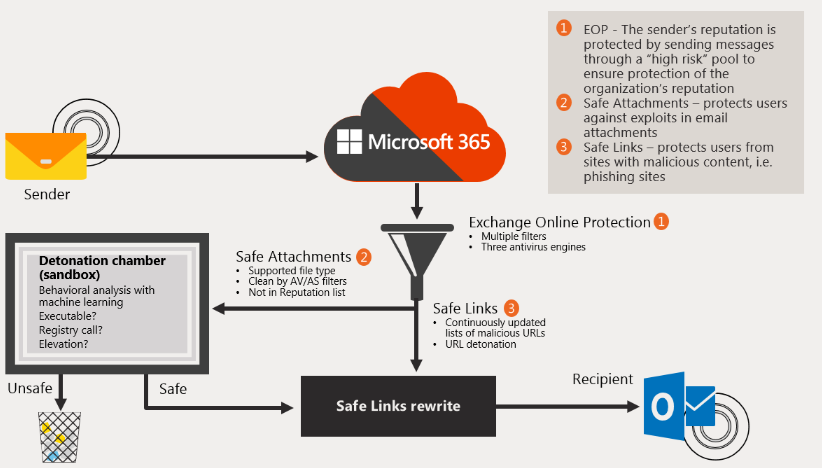
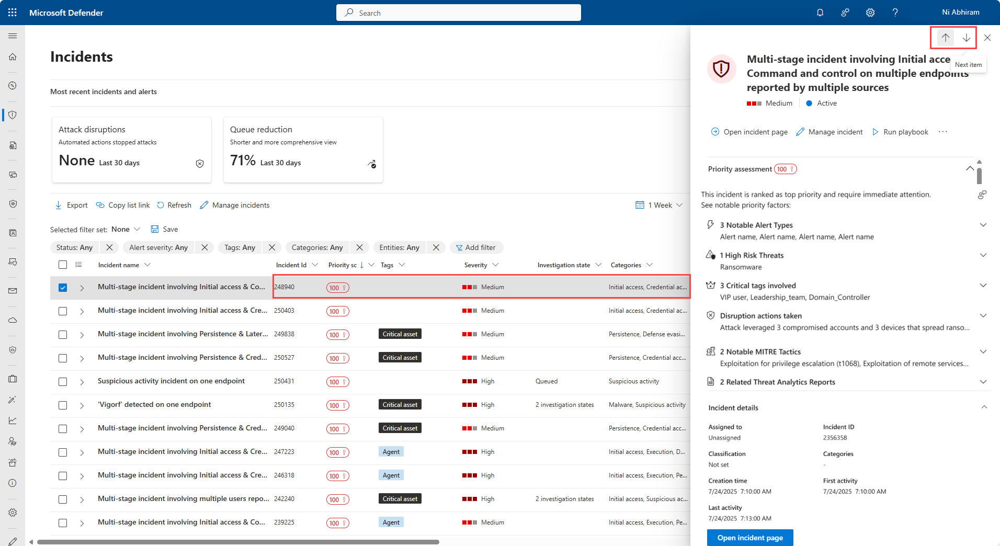
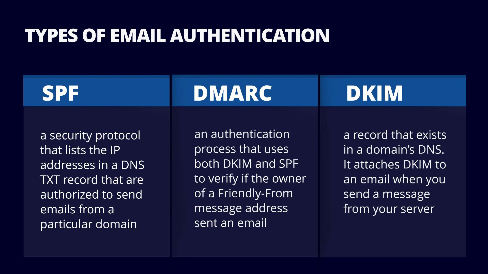
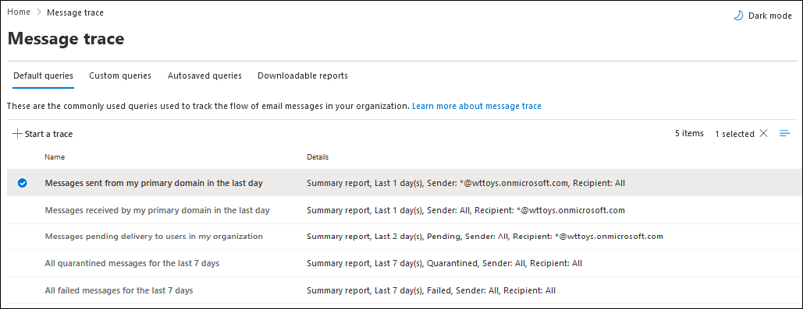
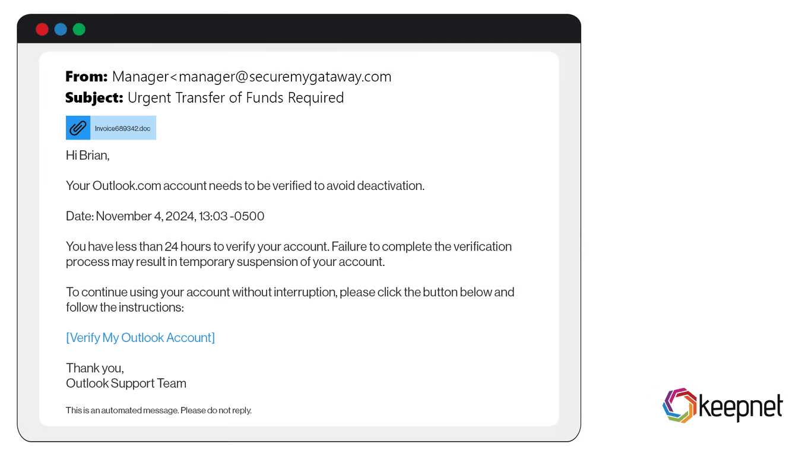

# Day 25 – Email Security Investigation (Phishing, Header Analysis, Message Trace)

---

## Objective

Understand how enterprise SOC analysts investigate **email-based attacks**, especially phishing, using Microsoft security tools. Learn how to analyze email headers, trace messages, and correlate activity across identity and endpoint telemetry.

---

## 1. Concept Overview

Email security investigation focuses on identifying **malicious emails**, understanding **delivery paths**, and determining whether a user interaction led to compromise.

Core areas:

* Phishing detection
* Email header analysis
* Message trace investigation
* User impact assessment

---

## 2. Why This Exists in Enterprise Security

Email is the **#1 initial access vector** in most attacks.

Attackers use email to:

* Steal credentials
* Deliver malware
* Initiate business email compromise (BEC)

SOC must:

* Detect malicious emails early
* Prevent lateral movement after compromise
* Identify impacted users

---

## 3. Architecture Context

```
External Sender
↓
Exchange Online Protection (EOP)
↓
Microsoft Defender for Office 365
↓
Email Events (Telemetry)
↓
Log Analytics Workspace
↓
Microsoft Sentinel Detection Rule
↓
Alert / Incident
↓
SOC Investigation
↓
ServiceNow Ticket
```

This integrates with:

* Microsoft Defender for Office 365 (Email security)
* Microsoft Sentinel (SIEM correlation)
* Microsoft Entra ID (identity validation)




---

## 4. Core Components

### Email Security Systems

* Exchange Online Protection (EOP)
* Microsoft Defender for Office 365

### Investigation Elements

* Email headers
* Sender reputation
* URLs and attachments
* Delivery status
* User interaction

### SOC Tools

* Microsoft Sentinel
* Defender portal
* Message trace tools

---

## 5. Log Sources / Data Sources

### Key Tables

**EmailEvents**

* Sender, recipient, subject
* Delivery action (Delivered, Blocked, Quarantined)

**EmailAttachmentInfo**

* File name
* Hash
* Malware detection

**EmailUrlInfo**

* URLs embedded in email
* Click tracking

**SigninLogs**

* Used to check credential compromise

**DeviceEvents**

* Used if payload executed

---

## 6. Detection Logic

### Detection Idea

Detect suspicious emails based on:

* External sender + internal user
* Suspicious domains
* Malicious URLs
* High volume delivery

---

### Example Detection Logic

```
EmailEvents
| where SenderFromDomain !endswith "yourcompany.com"
| where Subject has_any ("urgent", "password", "verify", "invoice")
| summarize count() by SenderFromAddress, Subject
| where count_ > 10
```

---

### Behavioral Indicators

* Domain spoofing
* Lookalike domains
* Unexpected attachments
* Urgency language

---

## 7. Investigation Workflow



### Step 1 – Alert Triage

* Identify:

  * Sender
  * Recipient(s)
  * Subject
  * Delivery action

---

### Step 2 – Email Analysis

Check:

* Is sender external?
* Domain reputation
* Suspicious wording
* Attachment presence
* URL analysis

---

### Step 3 – Header Inspection

Analyze:

* SPF (Sender Policy Framework)
* DKIM (DomainKeys Identified Mail)
* DMARC results
* Received path



---

### Step 4 – Message Trace

Trace email flow:

* Was it delivered?
* Who else received it?
* Was it forwarded?



---

### Step 5 – User Impact

Check:

* Did user click link?
* Did user download attachment?
* Any login activity?

---

### Step 6 – Correlation

```
EmailEvents
+
SigninLogs
+
DeviceEvents
```

Look for:

* Credential use after phishing
* Suspicious login locations
* Malware execution

---

### Step 7 – Verdict

* False Positive
* Phishing Attempt (No Impact)
* Confirmed Compromise

---

## 8. Common Attack Scenarios

### 1. Credential Phishing

```
Phishing Email
↓
User clicks link
↓
Fake login page
↓
Credentials stolen
↓
Attacker logs in
```


---

### 2. Malware Delivery

```
Email Attachment
↓
User opens file
↓
Malware executes
↓
Endpoint compromise
```

---

### 3. Business Email Compromise (BEC)

```
Spoofed Executive Email
↓
Finance team targeted
↓
Fraudulent payment request
```

---

## 9. SOC Analyst Responsibilities

### L1 Analyst

* Review alert
* Check sender/recipient
* Validate phishing indicators
* Identify affected users
* Escalate if needed

---

### L2 Analyst

* Deep header analysis
* Threat intelligence enrichment
* Correlate identity + endpoint logs
* Confirm compromise
* Recommend containment actions

---

## 10. Detection Example (Advanced)

```
EmailUrlInfo
| where Url contains "login" or Url contains "verify"
| summarize Clicks=count() by Url, RecipientEmailAddress
| where Clicks > 3
```

Detects:

* Phishing links with multiple clicks

---

## 11. False Positive Considerations

Legitimate emails may trigger alerts:

* Marketing emails
* Bulk notifications
* External vendor communications
* Automated systems

---

## 12. Tuning Strategy

Reduce noise by:

* Whitelisting trusted domains
* Filtering internal bulk senders
* Excluding known services
* Adjusting thresholds

---

## 13. Key Terminology

* Phishing
* Spoofing
* SPF / DKIM / DMARC
* Message Trace
* Email Telemetry
* Secure Email Gateway
* URL Detonation
* Attachment Sandboxing

---

## 14. Interview Talking Points

* Email is the primary initial access vector in attacks
* Header analysis helps verify sender authenticity
* Message trace is used to track email delivery across organization
* Phishing investigations require correlation with identity logs
* SOC must determine both **delivery and impact**

---

## 15. GitHub Documentation Section

# Day 25 – Email Security Investigation

## Objective

Understand phishing detection, header inspection, and message tracing in enterprise SOC.

## Architecture Context

Email → Defender for Office 365 → Log Analytics → Sentinel → Incident → SOC

## Core Components

* EmailEvents
* Header Analysis
* Message Trace
* URL & Attachment Inspection

## Log Sources

* EmailEvents
* EmailUrlInfo
* EmailAttachmentInfo
* SigninLogs
* DeviceEvents

## Detection Logic

Detect phishing using:

* External sender analysis
* Suspicious subject patterns
* URL indicators

## Investigation Workflow

1. Analyze email metadata
2. Inspect headers
3. Perform message trace
4. Check user interaction
5. Correlate identity and endpoint logs

## Example Detection

KQL-based phishing detection using subject and sender patterns.

## False Positives

Marketing emails, vendor communications.

## Detection Tuning

Whitelist trusted domains and adjust thresholds.

## Real Attack Scenario

Phishing → Credential Theft → Suspicious Login → Lateral Movement

## SOC Analyst Responsibilities

L1 triage, L2 deep investigation and correlation.

## Key Takeaways

* Email is a critical attack vector
* Header + trace analysis is essential
* Correlation across logs confirms compromise

---

## Final SOC Insight

Email investigation is not isolated.

Always think:

```
Email
↓
User Interaction
↓
Identity Compromise
↓
Endpoint Activity
↓
Lateral Movement
```

This is how real enterprise SOC investigations connect across systems.
