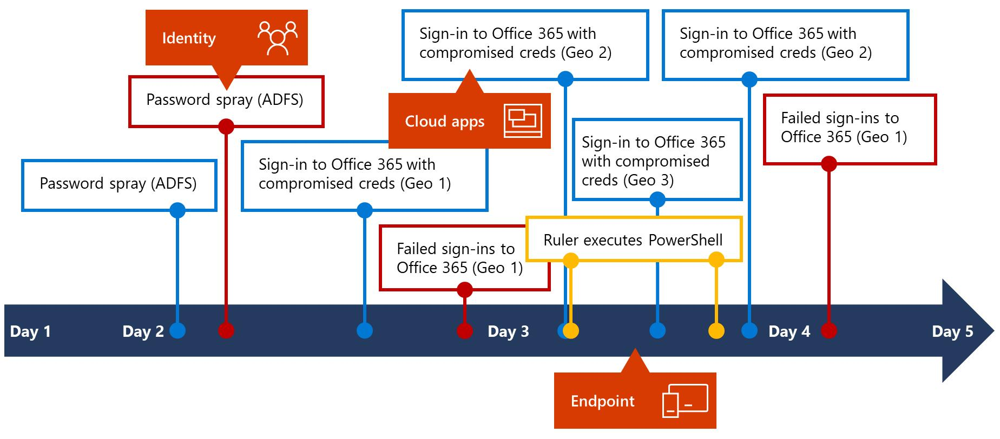
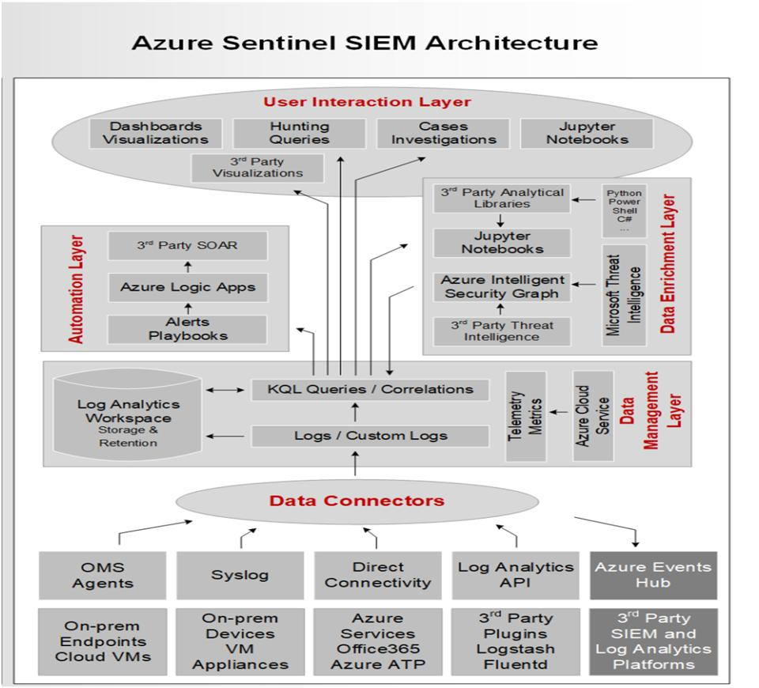
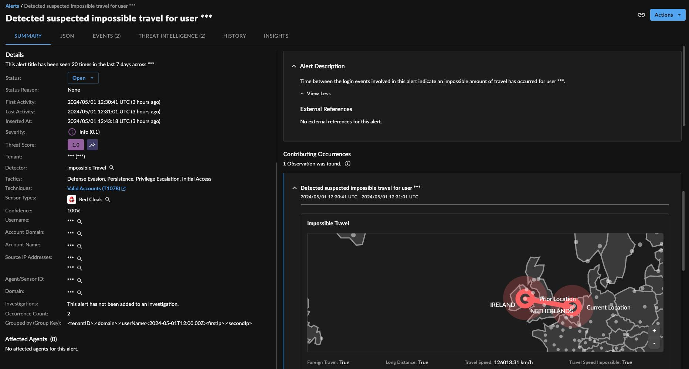
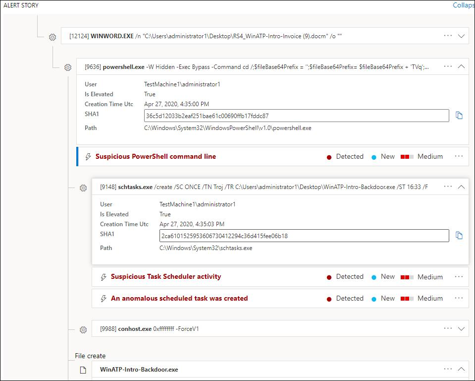
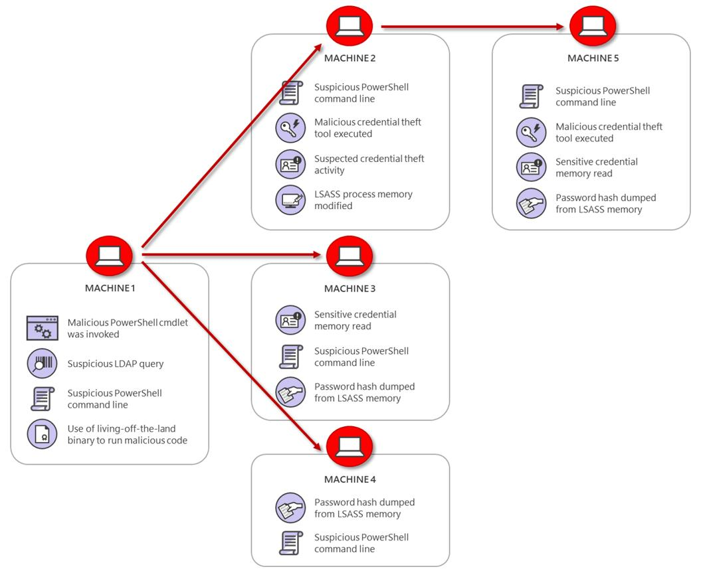
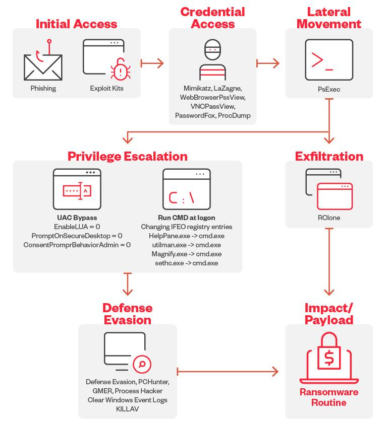
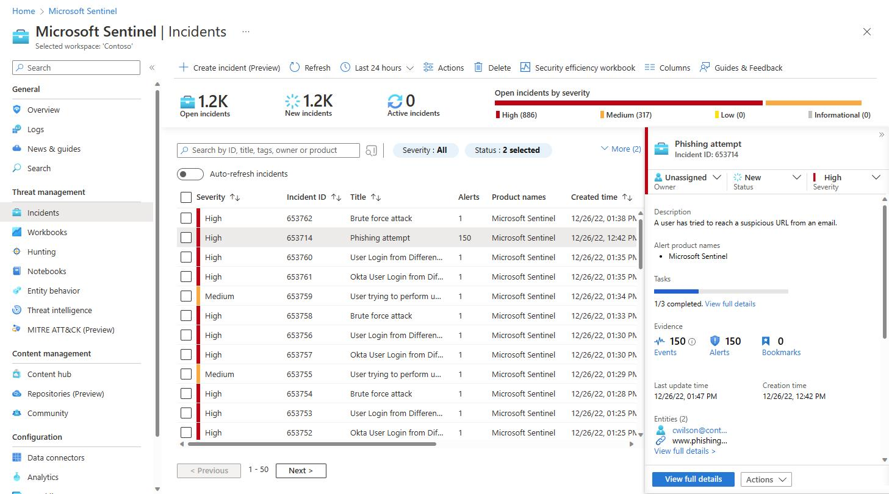
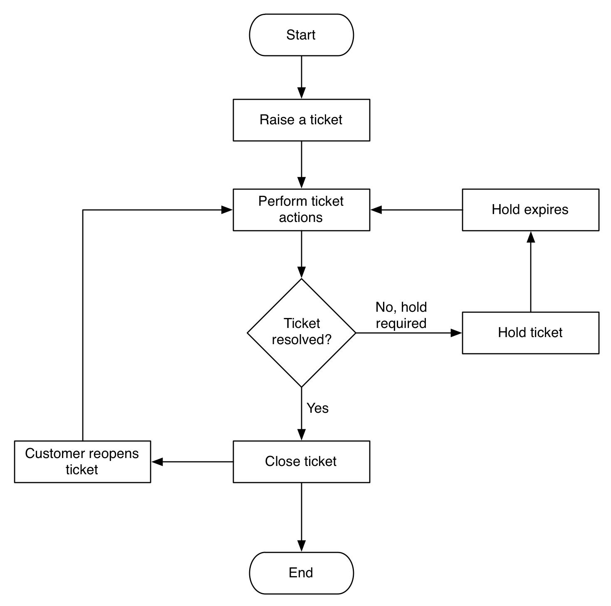

# Day 30 – Final SOC Case Study

## Full Enterprise SOC Incident Investigation Report

> This is the final capstone of the 30-day SOC journey.
> It simulates a **real enterprise attack chain investigation** across identity, endpoint, and SIEM.
> This aligns with the SOC workflow and detection pipeline defined earlier  and the Day 30 objective .

---

# 🔴 Objective

Simulate a **complete SOC investigation** covering:

```
Phishing Email
↓
Credential Theft
↓
Suspicious Login
↓
PowerShell Execution
↓
Lateral Movement
```

The goal is to:

* Correlate logs across multiple sources
* Reconstruct attack timeline
* Validate compromise
* Perform SOC-level incident response



---

# 🧠 Attack Overview (High-Level)

This is a **multi-stage attack** involving:

| Stage                | Tactic            | MITRE |
| -------------------- | ----------------- | ----- |
| Phishing             | Initial Access    | T1566 |
| Credential Theft     | Credential Access | T1556 |
| Suspicious Login     | Defense Evasion   | T1078 |
| PowerShell Execution | Execution         | T1059 |
| Lateral Movement     | Lateral Movement  | T1021 |

---

# 🏗️ Architecture Context

```
User Email (M365)
↓
Phishing Email Delivered
↓
User Clicks Link
↓
Credential Harvesting Page
↓
Attacker Logs In (Entra ID)
↓
SigninLogs Generated
↓
Suspicious Activity Detected (Sentinel)
↓
Endpoint Execution (Defender)
↓
DeviceProcessEvents (PowerShell)
↓
Lateral Movement (Remote Execution)
↓
Incident Created in Sentinel
↓
SOC Investigation
↓
ServiceNow Ticket
```


---

# 📡 Log Sources Involved

| Component       | Table               |
| --------------- | ------------------- |
| Email           | OfficeActivity      |
| Identity        | SigninLogs          |
| Endpoint        | DeviceProcessEvents |
| Endpoint        | DeviceNetworkEvents |
| Security Alerts | SecurityAlert       |
| Incident        | SecurityIncident    |

---

# 🔍 Stage 1 – Phishing Email Investigation

## What Happened

User receives a phishing email containing:

* Malicious link
* Fake login page
* Credential harvesting

## Detection Logic

```
OfficeActivity
| where Operation == "MailItemsAccessed"
| where Subject has "urgent" or "verify"
```

## Investigation Steps

1. Identify recipient user
2. Extract sender domain
3. Check:

   * Domain reputation
   * SPF/DKIM failure
4. Look for:

   * Link clicks
   * Attachment downloads

## Key Questions

* Was the email external?
* Did user click link?
* Was payload delivered?

---

# 🔑 Stage 2 – Credential Theft

## What Happened

User enters credentials on phishing site.

## Detection Indicator

* Login attempt from **unusual location**
* Token usage anomalies

## Detection Logic

```
SigninLogs
| where ResultType == 0
| where Location != "ExpectedCountry"
```


## Investigation Steps

1. Identify login time
2. Compare:

   * User’s normal login behavior
   * IP geolocation
3. Check:

   * MFA bypass
   * Token reuse

## Key Questions

* Was MFA triggered?
* Was login successful?
* Is IP malicious?

---

# 🌍 Stage 3 – Suspicious Login

## What Happened

Attacker logs in using stolen credentials.

## Detection Logic (Impossible Travel)

```
SigninLogs
| summarize count() by UserPrincipalName, IPAddress, Location
| where Location in ("Multiple Countries within short time")
```

## Investigation Steps

1. Compare login locations
2. Check:

   * Time difference
   * IP reputation
3. Identify session activity

## Key Indicators

* New device
* New IP
* Abnormal time

---

# 💻 Stage 4 – PowerShell Execution

## What Happened

Attacker executes malicious PowerShell.

## Detection Logic

```
DeviceProcessEvents
| where ProcessCommandLine contains "powershell"
| where ProcessCommandLine contains "-enc" or "download"
```


## Investigation Steps

1. Identify process tree:

```
Outlook.exe
↓
Browser.exe
↓
powershell.exe
```

2. Analyze command:

* Encoded payload
* Download script
* Remote execution

3. Extract:

* File hash
* URL
* Script content

---

# 🔗 Stage 5 – Lateral Movement

## What Happened

Attacker moves across systems.

## Techniques

* PsExec
* WMI
* Remote PowerShell



## Detection Logic

```
DeviceProcessEvents
| where ProcessCommandLine contains "psexec" 
   or ProcessCommandLine contains "wmic"
```

## Investigation Steps

1. Identify source machine
2. Identify target machines
3. Check:

* Remote logins
* Admin account usage
* Service creation

## Key Questions

* Which systems are compromised?
* Is domain admin involved?

---

# 🧩 Correlation Across Attack Chain

## Full Timeline Reconstruction

```
Email Delivered → 09:00
↓
User Click → 09:02
↓
Credential Theft → 09:03
↓
Suspicious Login → 09:05
↓
PowerShell Execution → 09:10
↓
Lateral Movement → 09:20
```



---

# 🧠 Detection Correlation Logic

```
OfficeActivity
JOIN SigninLogs ON User
JOIN DeviceProcessEvents ON DeviceId
```

This connects:

* Email → Identity → Endpoint

---

# 🚨 Incident Creation (Sentinel)

## Incident Contains:

* Multiple alerts:

  * Suspicious login
  * PowerShell execution
  * Lateral movement



## Entity Mapping:

* User
* IP Address
* Device
* Process

---

# 🔎 SOC Investigation Workflow

## L1 Analyst

1. Review alert
2. Validate suspicious login
3. Check user activity
4. Escalate if confirmed

## L2 Analyst

1. Correlate logs
2. Analyze process tree
3. Confirm lateral movement
4. Scope impact

---

# ⚠️ False Positive Considerations

| Detection        | Possible False Positive |
| ---------------- | ----------------------- |
| Suspicious login | VPN usage               |
| PowerShell       | Admin scripts           |
| Lateral movement | IT automation tools     |

---

# 🎯 Detection Tuning Strategy

* Exclude:

  * Known admin IPs
  * Trusted scripts
* Add:

  * Geo anomalies
  * Behavioral baselines
* Threshold tuning:

  * Login frequency
  * Execution patterns

---

# 🧪 Final Incident Classification

| Attribute | Value              |
| --------- | ------------------ |
| Type      | Account Compromise |
| Severity  | High               |
| Impact    | Multiple systems   |
| Status    | Confirmed Incident |

---

# 🛡️ Response Actions

## Immediate

* Disable user account
* Revoke sessions
* Block IP

## Containment

* Isolate affected devices
* Kill malicious processes

## Eradication

* Remove persistence
* Delete payloads

## Recovery

* Reset credentials
* Restore systems

---

# 📋 ServiceNow Ticket Flow

```
Incident Created
↓
Assigned to SOC
↓
Investigation Notes Added
↓
Response Actions Logged
↓
Closed with Root Cause
```


---

# 📚 Key Terminology

* Phishing Attack
* Credential Theft
* Suspicious Login
* PowerShell Abuse
* Lateral Movement
* SIEM Correlation
* Endpoint Telemetry
* Incident Response

---

# 🎤 Interview Talking Points

* End-to-end SOC investigation requires **cross-domain correlation**
* Identity compromise is often the **entry point**
* PowerShell is heavily used in **post-exploitation**
* Lateral movement indicates **deep compromise**
* Sentinel correlates alerts into **single incident view**

---

# 🧾 GitHub Documentation Section

## # Day 30 – Full SOC Incident Report

### Objective

Simulate a full attack lifecycle investigation across email, identity, and endpoint.

### Architecture Context

Email → Identity → Endpoint → Sentinel → Incident → ServiceNow

### Detection Logic

* Phishing detection (OfficeActivity)
* Suspicious login (SigninLogs)
* PowerShell execution (DeviceProcessEvents)
* Lateral movement indicators

### Investigation Workflow

* Timeline reconstruction
* Cross-source correlation
* Entity analysis

### Real Attack Scenario

Phishing → Credential theft → Unauthorized login → Execution → Lateral movement

### SOC Responsibilities

* L1: triage + validation
* L2: deep investigation + correlation

### Key Takeaways

* Enterprise SOC is **correlation-driven**
* Attacks are **multi-stage**
* Logs must be analyzed **together, not separately**

---

# 🧠 Final Insight

This case study represents how **real SOC environments operate**:

```
No single alert proves compromise.
Correlation proves compromise.
Timeline proves impact.
Investigation proves intent.
```

---

# 🚀 You Now Have

* Full SOC workflow understanding
* Detection engineering mindset
* Investigation thinking
* Real-world case study for portfolio

This completes the **30-day enterprise SOC journey** .

You now think like a **SOC analyst — not just a learner.**
